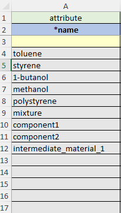

# Excel Rows

## <b> Row 1 Row 2 Row 3 </b>

The Row 1 - 3 within each Excel
sheet are treated differently than Rows 4 - ∞.

 

- Row 1: Describes the abstract category of Row 2

  > It can be thought of as an abstraction of row 2

## <u id="row-1-options-list">List of possible options for Row 1</u>

- attribute
  - Column with simple key-value pairs
- condition
  - Column with key, value, and unit combinations for
  - The condition under which the property was discerned
- identifier
  - Column with key-value pairs for material identifiers
- property
  - Column with key, value, and unit combinations for properties
- relation
  - Column that reference other sheets in the template
- quantity
  - Column with key, value and unit combinations for quantities

 

> `Relation` is a bit tricky to explain, so we dedicated a section that <a href="#relation-explanation">explains row 1
> abstract category of `relation`</a>

 

---

- Row 2: This is the label for each column

  - Eg. `name`, `density`, `bigsmiles`

  - Each label for each sheet column from a controlled list of vocabulary options from CRIPT
    - Each list of controlled vocabulary options will be listed as a link in the
      <a href="/individual sheets/">Individual Sheets page</a>

 

---

- Row 3: Defines the units for that column

  - `celsius`, `g/ml`
  - All the <a href="https://github.com/hgrecco/pint/blob/master/pint/default_en.txt" target="_blank">supported units are
    documented</a>

 

---

 

## <b>relation</b> field in row 1 explained

The row 1 field <code>relation</code> is essentially a way for a row from one sheet to reference another row in a
different sheet.

In computer science terms, we could think of it as a foreign key type of relationship from the
<code>relation</code> row of one
sheet to the <code>\*name</code> row of another sheet, the name field works well as an identifier because we are
requiring names to be unique within a given sheet.

---

 

## row 2

[//]: # "todo consider putting this section in the section where you explain ROW 1, ROW 2, ROW 3"

### row 2 <u>Column Field Names</u>

<blockquote>
  <ul>
    <li>
      Columns beginning with <code>*</code> are required (eg. <code>*name</code>)
    </li>
    <li>
      Columns beginning with <code>#</code> will be ignored (eg. <code>#storage</code>)
      <ul>
        <li>
          <code>#</code> columns are a good idea to use if you want to have some notes, but don't want it necessarily read or uploaded to CRIPT
        </li>
      </ul>
    </li>
  </ul>
</blockquote>

 

Individual Excel Sheets page has a 
<a href="/individual sheets/">valid values for each sheet's row 2</a>

---

 

### <u>Nesting Headers for each column in row 2</u>

- We can have more than one field present on a column header if needed
  - We can indicate that we are recording the `density` at a certain `temperature` by using a colon `":"` and notating
    it like this: `"density:temperature"`
  - Examples
    - Define a material property method: `density:method`
    - Associate data with a process condition `temperature:data`
    - Associate a citation with a material property: `density:citation`
    - Define material property condition: `density:temperature`
    - Define the uncertainty of a material property condition: `density:temperature:uncertainty`
      > `<field>:data` column values should derive from the `*name` column of the `Data` sheet.  
      > `<field>:citation` column values should derive from the `*name` column of the `Citation` sheet.

---

 

### `Id`  - (optional)

`Id` is used to allow for multiple measurements throughout time. With `Id` it is possible to take several measurements
through an experiment, and later use nesting to record more details.

If there are multiple densities throughout time, and we want to show each of their temperatures (or any other
condition) we can use an `Id` field to differentiate between the different temperatures. We denote an `Id` with brackets
and a number inside such as [1] or [2]. The `Id` is used to identify distinct properties/conditions of the same type

- e.g., To identify two density measurements at two different temperatures, we could create the following column
  headers: [1]density, [1]density:temperature
  , [2]density, [2]density:temperature

 

<table>
  <tr>
    <td class="row-1">
      property
    </td>
    <td class="row-1">
      property:condition
    </td>
    <td class="row-1">
      property
    </td>
    <td class="row-1">
      property:condition
    </td>
  </tr>
  <tr>
    <td class="row-2">
      [1]density
    </td>
    <td class="row-2">
      [1]density:temperature
    </td>
    <td class="row-2">
      [2]density
    </td>
    <td class="row-2">
      [2]density:temperature
    </td>
  </tr>
  <tr class="row-3">
    <th class="row-3">
        g/ml
    </th>
    <th class="row-3-in-table">
      degC
    </th>
    <th class="row-3">
        g/ml
    </th>
    <th class="row-3-in-table">
      degC
    </th>
  </tr>
  <tr class="row-4">
    <td>
      0.87
    </td>
    <td>
      20
    </td>
    <td>
      1
    </td>
    <td>
      30
    </td>
  </tr>
</table>

<!--
Here, we are recording the [1]density, and then we are recording the temperature of that
density with [1]density:temperature and then we have a different [2]
density at a different time and then we are recording the temperature of that density [2]
density:temperature
-->

 

---

## Row 4 - ∞

### <u>Inputting list instead of a single value</u>

List values must use a semicolon **`;`** as a separator

Example:

<table>
  <tr class="row-1">
    <td class="row-1">
      category
    </td>
  </tr>
  <tr>
    <td class="row-2">
      field name
    </td>
  </tr>
  <tr class="row-3">
    <th class="row-3">
        units
    </th>
  </tr>
  <tr class="row-4">
    <td>
      funder 1; funder 2; funder 3; funder 4
    </td>
  </tr>
</table>

 