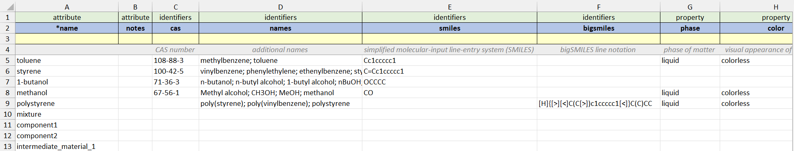
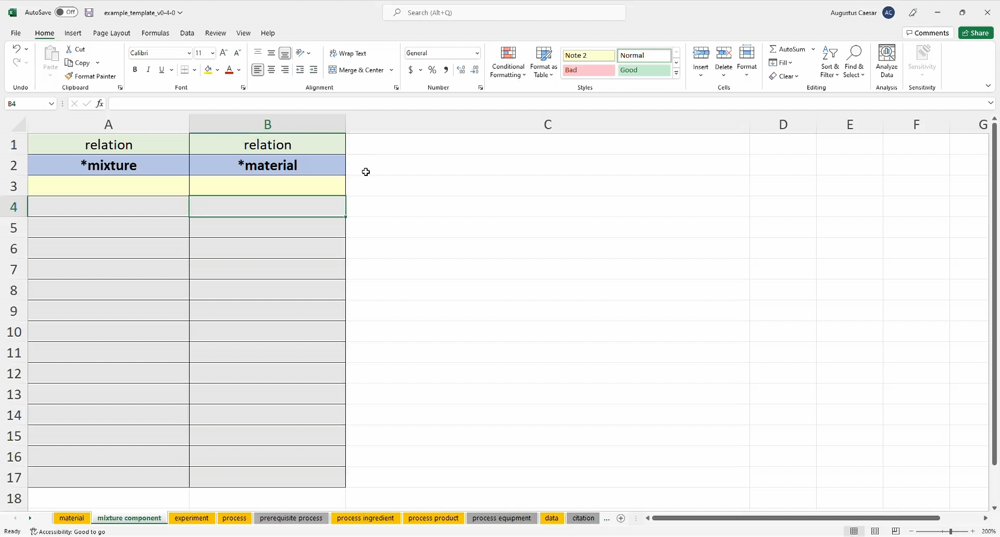
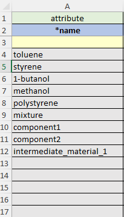
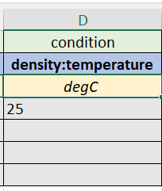

# Excel Rows

<b style="font-size: 1.2rem"> 
    Row 1 
    Row 2 
    Row 3
    Row 4
</b>

The Row 1 - 4 within each Excel
sheet are treated differently than Rows 5 - ∞. 

The CRIPT Excel Uploader reads row 1 - 3, and will skip row 4 as row 4 is human instructions and the program does not need them. User input can only start from row 5

Please refer to <a href="../individual_sheets" target="_blank">Individual Excel Sheets</a> 
for a complete breakdown of each sheet

---

## Row 1: **Category**

Row 1 can be thought of as describing the abstract category of Row 2

 

#### <u id="row-1-options-list">List of all possible options for Row 1</u>

- attribute
    - Column with simple key-value pairs
- condition
    - The condition under which the property was found
    - Some examples include `temperature`, `mixing_rate`, `stirring`, `time_duration`
    - Please visit <a href="https://criptapp-staging.herokuapp.com/keys/condition-key/" target="_blank">
      condition controlled vocabulary</a> for a full list of conditions
- identifier
    - Column with key-value pairs for material identifiers
    - An example of an identifier can be `smiles`, `bigSmiles`, `cas`, etc.
    - Please visit <a href="https://criptapp.org/keys/material-identifier-key/" target="_blank">
      material identifier controlled vocabulary</a> for a full list of material identifiers
- property
    - Column with key, value, and unit combinations for properties
- relation
    - Column that shows a relationship between a row from one sheet to the row of another sheet
    - relation is further explained in <a href="#relation-explanation" target="_blank">relation section</a>
- quantity
    - Column with key, value and unit combinations for quantities
    - Column that describes the amount combined with a unit

<!-- Quantity Example for Row 1 -->
Example of **quantity** in <code>process ingredients</code> sheet

<table>
  <tr>
    <td class="row-1">
      attribute
    </td>
    <td class="row-1">
      quantity
    </td>
  </tr>
  <tr>
    <td class="row-2">
      *name
    </td>
    <td class="row-2">
      volume
    </td>
  </tr>
  <tr>
    <th class="row-3">
      

    </th>
    <th class="row-3">
      ml
    </th>
  </tr>
  <tr>
    <td class="row-4">
      water
    </td>
    <td class="row-4">
      5
    </td>
  </tr>
</table>

 

#### <b>relation</b> field in row 1 explained

The row 1 field <code>relation</code> is essentially a way for a row from one sheet to reference another row in a
different sheet.

In computer science terms, we could think of it as a foreign key type of relationship from the
<code>relation</code> row of one
sheet to the <code>\*name</code> row of another sheet, the name field works well as an identifier because we are
requiring names to be unique within a given sheet.

---

 

## Row 2: **Column Name**

> This can be seen as the label for each column

> The breakdown can be found in <a href="../individual_sheets" target="_blank">Individual Excel Sheets</a>

  <ul>
    <li>
      Columns beginning with <code>*</code> are required (eg. <code>*name</code>)
    </li>
    <li>
      Columns beginning with <code>#</code> will be ignored (eg. <code>#storage</code>)
      <ul>
        <li>
          <code>#</code> columns are a good idea to use if you want to have some notes, but don't want it necessarily read or uploaded to CRIPT
        </li>
      </ul>
    </li>
    <li>
        Some sheets have dropdowns for row 2. 
        After selecting an option, row 1, row 3, and row 4 are automatically populated with the correct information
        <blockquote>
            As we continue to update the controlled vocabulary,
            it is very possible that the dropdown options and autofill can become outdated.
        </blockquote>
    </li>
    <li>
        Each Excel sheet has row 1, 3, 4 locked and the sheets are protected.
        <ul>
            <li>
                This is because rows 1, 3, 4 contain formulas that if accidentally deleted or overwritten 
                would break the autofill feature 
            </li>
            <li>
                The sheets are protected without a password and can be easily unprotected
            </li>
        </ul>
    </li>
  </ul>

 

---

 

### <u>Nesting Headers for each column in row 2</u>

- We can have more than one field present on a column header if needed
    - We can indicate that we are recording the `density` at a certain `temperature` by using a colon `":"` and notating
      it like this: `"density:temperature"`
    - Examples
        - Define a material property method: `density:method`
        - Associate data with a process condition `temperature:data`
        - Associate a citation with a material property: `density:citation`
        - Define material property condition: `density:temperature`
        - Define the uncertainty of a material property condition: `density:temperature:uncertainty`
          > `<field>:data` column values should derive from the `*name` column of the `Data` sheet.  
          > `<field>:citation` column values should derive from the `*name` column of the `Citation` sheet.

---

 

### `Id`  - (optional)

`Id` is used to allow for multiple measurements throughout time. With `Id` it is possible to take several measurements
through an experiment, and later use nesting to record more details.

If there are multiple densities throughout time, and we want to show each of their temperatures (or any other
condition) we can use an `Id` field to differentiate between the different temperatures. We denote an `Id` with brackets
and a number inside such as [1] or [2]. The `Id` is used to identify distinct properties/conditions of the same type

- e.g., To identify two density measurements at two different temperatures, we could create the following column
  headers: [1]density, [1]density:temperature
  , [2]density, [2]density:temperature

 

<table>
  <tr>
    <td class="row-1">
      property
    </td>
    <td class="row-1">
      property:condition
    </td>
    <td class="row-1">
      property
    </td>
    <td class="row-1">
      property:condition
    </td>
  </tr>
  <tr>
    <td class="row-2">
      [1]density
    </td>
    <td class="row-2">
      [1]density:temperature
    </td>
    <td class="row-2">
      [2]density
    </td>
    <td class="row-2">
      [2]density:temperature
    </td>
  </tr>
  <tr class="row-3">
    <th class="row-3">
        g/ml
    </th>
    <th class="row-3-in-table">
      degC
    </th>
    <th class="row-3">
        g/ml
    </th>
    <th class="row-3-in-table">
      degC
    </th>
  </tr>
  <tr class="row-4">
    <td>
      0.87
    </td>
    <td>
      20
    </td>
    <td>
      1
    </td>
    <td>
      30
    </td>
  </tr>
</table>

<!--
Here, we are recording the [1]density, and then we are recording the temperature of that
density with [1]density:temperature and then we have a different [2]
density at a different time and then we are recording the temperature of that density [2]
density:temperature
-->

 

---
## Row 3: **Units**

- Row 3: Defines the units for that column

    - `celsius`, `g/ml`
    - All the <a href="https://github.com/hgrecco/pint/blob/master/pint/default_en.txt" target="_blank">supported
      units</a> are documented within the Pint python package

 

---
## Row 4: **Instructions**
Many columns contain instructions on row 4 that tries to clarify the data that should go in 
that column after the value for row 2 is picked

---

## Row 5 - ∞ : **User Input**

### <u>Inputting list instead of a single value</u>
Some columns allow for more than a single value. List values must use a semicolon **`;`** as a separator

Example:

<table>
  <tr class="row-1">
    <td class="row-1">
      category
    </td>
  </tr>
  <tr>
    <td class="row-2">
      column name
    </td>
  </tr>
  <tr class="row-3">
    <td class="row-3" style="font-weight: 500">
        units
    </td>
  </tr>
<tr>
    <th class="instruction-row" style="font-weight: 500">
      instructions
    </th>
</tr>
  <tr class="row-4">
    <td>
      funder 1; funder 2; funder 3; funder 4
    </td>
  </tr>
</table>

 