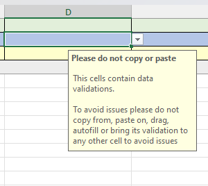
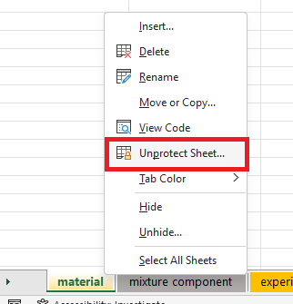
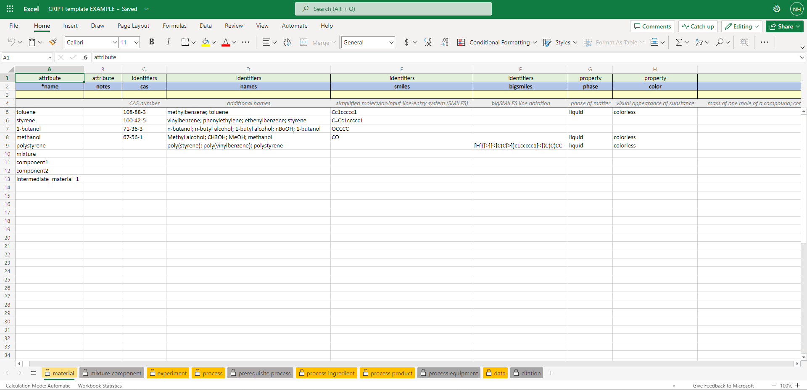
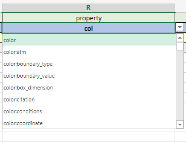

# CRIPT Excel Template

## Autofill
The Excel template comes with autofill feature. Users can now click on row 2 (column names) and pick from a list of available columns options that each sheet supports. Once an options is selected, row 1 (category), row 3 (unit), and row 4 (instructions) are populated based on the selected option. This way users do not need to consider any other details except what they want to record in the Excel sheets.

The autofill feature is fairly new and has some drawbacks as well. Firstly, as controlled vocabulary is updated and changed within the <a href="https://criptapp.org/" target="_blank">CRIPT website</a>, 
the Excel sheets does not have the ability to get the newest vocabulary, is unaware of any updates to the <a href="https://criptapp.org/keys/" target="_blank">CRIPT controlled vocabulary</a>, and instead will keep the vocabulary that it came with at the time it was released. 
This could result in the Excel sheet giving validation errors that your new key that you got from 
<a href="https://criptapp.org/keys/" target="_blank">CRIPT controlled vocabulary</a> is not valid when in fact it is, but Excel is not aware of the changes on the <a href="https://criptapp.org/" target="_blank">CRIPT website</a>, and therefore might give you false warnings.

The dropdown list is very large but is not a comprehensive list of every single possible value for row 2 (column name),
and there can be values that are valid, but are not contained in the dropdown options for the Excel file.

For most complete and up-to-date list of vocabulary please always check the 
<a href="https://criptapp.org/keys/" target="_blank">CRIPT controlled vocabulary</a> page.

### Data validation
To avoid any problems please do not copy, cut, paste, or drag cells with dropdown data validations into any other cell. The reason for this is that it could break the data validation for that cell and accidentally bring the value of that cell, its formulas, and data validation into another cell by accident and cause errors. 

There are also input messages that show on cells that contain data validation to help alert the user to not accidentally break it.

## Protected sheets
The sheets are protected because rows 1, 3, and 4 contain formulas that we want to prevent the user from accidentally deleting them. If the user feels like they do not want/need the protection they can easily unlock the sheets as the Excel sheets protection do not contain any passwords. Unlocking the sheet can be done several ways but a convenient way is to right-click on the sheet and click unprotect sheet.

## Excel Online

The dropdown list for many of the sheets can be rather large, the Microsoft Excel desktop team has announced that they are working on a searchable dropdown list, however, currently it is only available on Excel desktop beta. 

Microsoft also offers <a href="https://www.office.com/launch/excel" target="_blank">Excel Online</a> that user can use for free, edit Excel files online, save instantly online, and work together at the same time. Excel online has currently implemented the searchable dropdown list that makes working with the Excel file much easier. Users can upload their Excel files to OneDrive and then edit their Excel files with Excel online to take full advantage of the searchable dropdown list.

