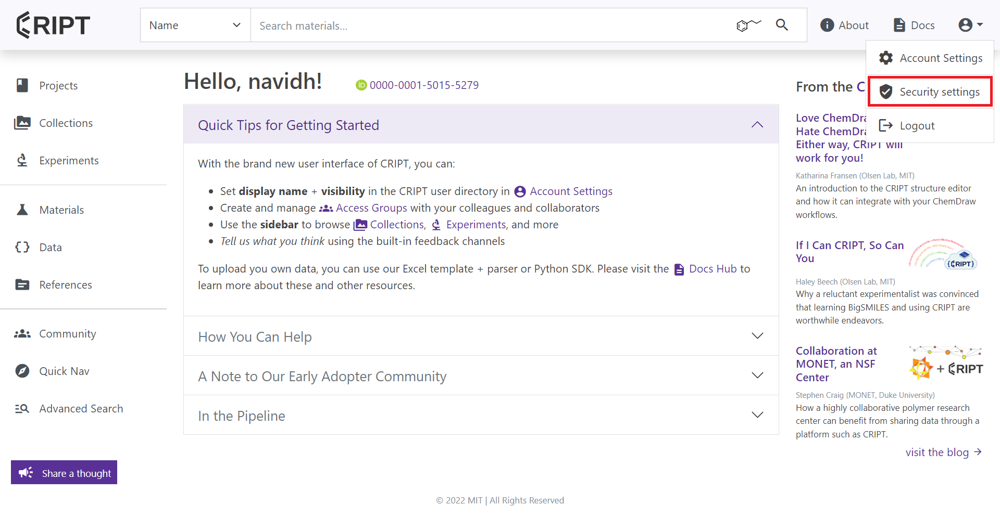
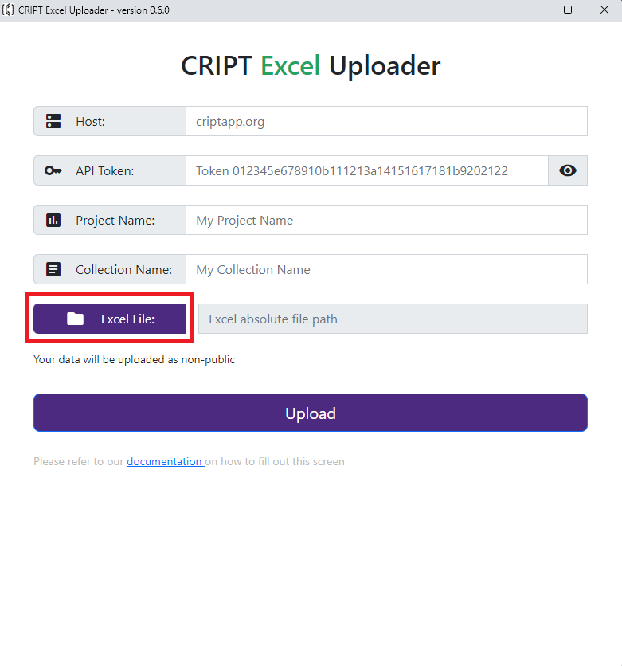

# Filling out first screen


---

## Host

Host indicates the CRIPT instance that you want to upload your data to whether that is
<a href="https://criptapp.org/" target="_blank">CRIPT</a> or a private instance

For most users host will be `criptapp.org`

```yaml
host: criptapp.org
```

<br>

However, if any user wants to connect to their own private instance of cript, they can easily do that by changing the
host to whatever URL they are using

Private Instance Example:

```yaml
host: myPrivateWebsite.com
```

---

## API Token

The token is needed because we need to authenticate the user before saving any of their data

<br>




<small>
   <a href="https://criptapp.org/security/" target="_blank">Security Settings</a> under the profile icon dropdown
</small>

<br>

To get your token:

1. please visit your <a href="https://criptapp.org/security/" target="_blank">Security Settings</a> under the profile
   icon dropdown on
   the top right
2. Click on the <b>copy</b> button next to the API Token to copy it to clipboard
3. Now you can paste it into the `API Token` field

> Note: The "Token" in front of the random characters is part of the token as well

<br>

Example:

```yaml
API Token: Token 4abc478b25e30766652f76103b978349c4c4b214
```

---

## Project Name

Project is needed for the software to know which project these experiments are for, and each Collection belongs to a
Project

A Project can be thought of as a bunch of folders each containing experiments that contribute to a single project

<br>


<small>
<a href="https://criptapp.org/project/" target="_blank">projects tab</a> within CRIPT
</small>


<br>

To get project name, follow these steps:

1. Navigate to the <a href="https://criptapp.org/project/" target="_blank">projects tab</a> within CRIPT
2. Find the project you want to upload your data under
3. Copy the name and paste it into `Project Name` field

Example:

```yaml
Project Name: CRIPT Examples
```

---

## Collection Name

A Collection can be thought of as a binder filled with experiments

The entire <span style="color: #21a366">Excel</span> file will become a collection within the CRIPT Platform

<br>


<small>
   <a href="https://criptapp.org/collection/" target="_blank">Collections tab</a> within CRIPT
</small>

<br>

To get your collection name, follow these steps:

1. Please visit the <a href="https://criptapp.org/collection/" target="_blank">collections tab</a> within CRIPT
2. Find the collection you want to use
3. copy the name of that collection and paste it into the `Collection Name` field

Example:

```yaml
Collection Name: Tutorial
```

---

## Excel File



Please click the purple Excel File button and select the Excel file you wish to upload to CRIPT

<br> <br>
