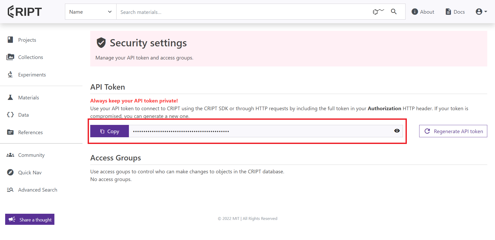
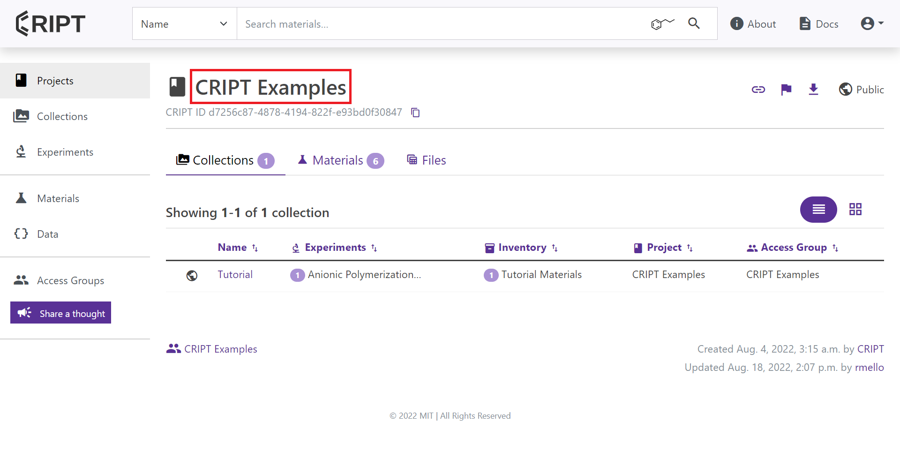

# How to fill out config.yaml

## How to open config.yaml

Please open and edit the config.yaml file with your preferred text editor.
Some good choices can be notepad (that comes preinstalled on windows),
<a href="https://notepad-plus-plus.org/" target="_blank">notepad++</a>, and
<a href="https://code.visualstudio.com/" target="_blank">vs code</a>


---

## Host

Host indicates the CRIPT instance that you want to upload your data to whether that is
<a href="https://criptapp.org/" target="_blank">CRIPT</a> or a private instance

For most users host will be `criptapp.org`

```yaml
host: criptapp.org
```

<br>

However, if any user wants to connect to their own private instance of cript, they can easily do that by changing the
host to whatever URL they are using

Private Instance Example:

```yaml
host: myPrivateWebsite.com
```

---

## Token

The token is needed because we need to authenticate the user before saving any of their data

<br>





<small>
   <a href="https://criptapp.org/security/" target="_blank">Security Settings</a> under the profile icon dropdown
</small>

<br>

To get your token:

1. please visit your <a href="https://criptapp.org/security/" target="_blank">Security Settings</a> under the profile
   icon dropdown on
   the top right
2. Click on the <b>copy</b> button next to the API Token to copy it to clipboard
3. Now you can paste it into the token section of config.yaml

> Note: The "Token" in front of the random characters is part of the token as well

<br>

Example:

```yaml
token: Token 4abc478b25e30766652f76103b978349c4c4b214
```

---

## Project

Project is needed for the software to know which project these experiments are for, and each Collection belongs to a
Project

A Project can be thought of as a bunch of folders each containing experiments that contribute to a single project

<br>


<small>
<a href="https://criptapp.org/project/" target="_blank">projects tab</a> within CRIPT
</small>


<br>

To get project name, follow these steps:

1. Navigate to the <a href="https://criptapp.org/project/" target="_blank">projects tab</a> within CRIPT
2. Find the project you want to upload your data under
3. Copy the name and paste it into config.yaml

Example:

```yaml
project: CRIPT Examples
```

---

## Collection

A Collection can be thought of as a binder filled with experiments

The entire <span style="color: #21a366">Excel</span> file will become a collection within the CRIPT Platform

<br>


<small>
   <a href="https://criptapp.org/collection/" target="_blank">Collections tab</a> within CRIPT
</small>

<br>

To get your collection name, follow these steps:

1. Please visit the <a href="https://criptapp.org/collection/" target="_blank">collections tab</a> within CRIPT
2. Find the collection you want to use
3. copy the name of that collection and paste it into the config.yaml file

Example:

```yaml
collection: Tutorial
```

---

## Path

Please indicate the path where the executable file is located

> Please note the path may look different depending on the operating system whether the computer is running Windows,
> Mac, or Linux

Example:

```yaml
path: C:\Users\myUsername\OneDrive\Desktop\MIT\cript-excel-uploader
```

---

## Public

This option indicates to our software whether we want to keep the uploaded data private or public

This takes a boolean value of either True or False

We can indicate yes, if we want the uploaded data be publicly available

```yaml
public: yes
```

We can indicate no, if we want the uploaded data be private, and hidden from the public

```yaml
public: no
```

<br> <br>
