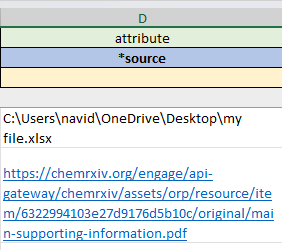
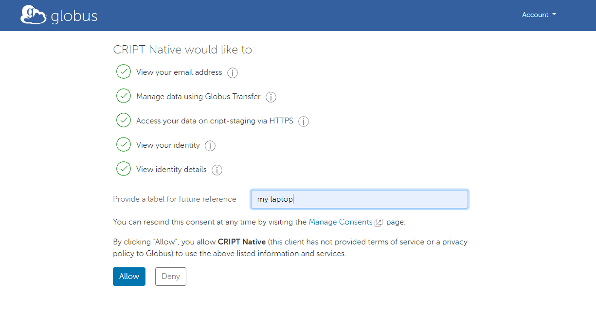
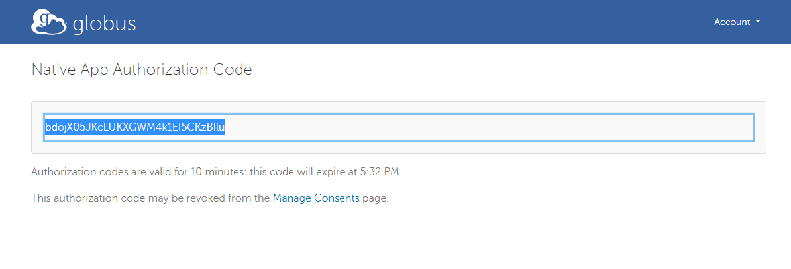
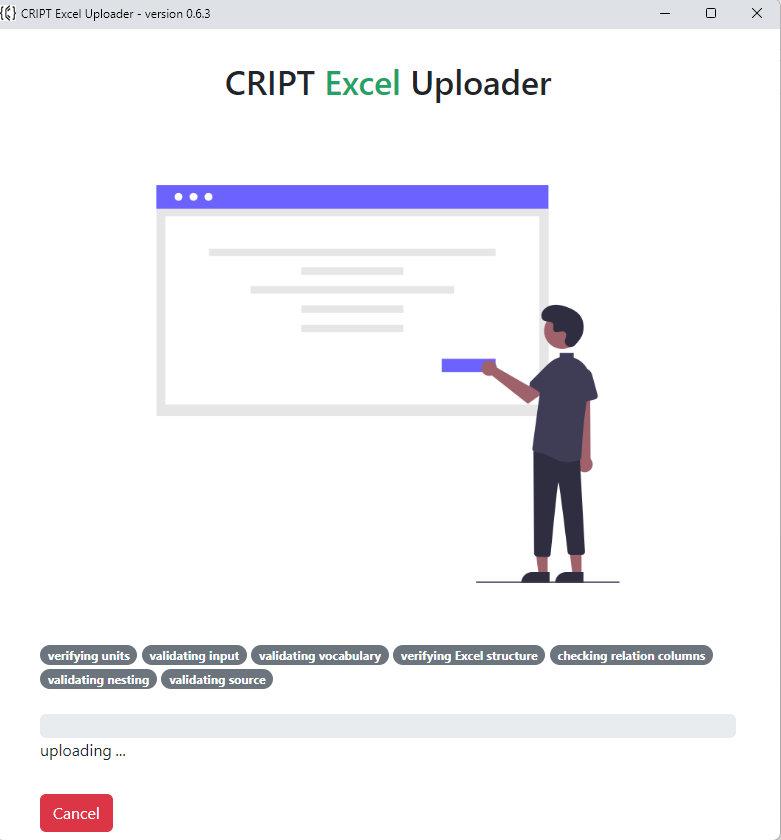

# Globus Authentication

## Globus Screen Conditions
The <u>Globus Authentication for Local File Uploads</u> screen is **required** if:

* You indicate on the `Excel file > data sheet > *source column` that you are uploading a local file from your computer to CRIPT via inputting an absolute path of a file on your computer.

The program may **skip** this screen completely if: 

1. The `*source` column is empty indicating you are not uploading any files
2. All inputs under the *source column are only web URLs

!!! note annotate "Storing linked files vs local files"
    CRIPT uses <a href="https://www.globus.org/" target="_blank">Globus</a> to store uploaded files. Authentication is **_not required_** with Globus when inputting links to web files under the `*source` column because CRIPT will only point to the links and not upload the linked files to CRIPT. 

## Globus Website

Please provide a label in the field labeled “Provide a label for future reference” within the Globus Authentication page. The label is insignificant for our uses and can be anything you like, and then click the `Allow` button.

Please copy the Authorization code and enter it into the Excel Uploader and click submit to continue

