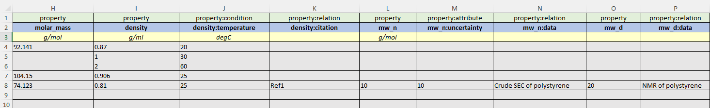
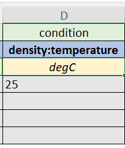

<style>
  /* used for  "Follow these steps" section */
  #usage-steps>li {
    margin-bottom: 2rem;
  }

  body{
    /* logo colors */
    --excel-dark-color: #0d7239;
    --excel-light-color: #21a366;
    --yaml-color: #CE272D;
    --cript-color: #6d3eb5;
  }

/* excel row colors */
  .row-1 {
    background-color: #E3EEDA;
    color: black;
    text-align: center;
  }

  .row-2 {
    background-color: #B5C7E7;
    color: black;
    text-align: center;
  }

  .row-3 {
    background-color: #FEFECC;
    color: black;
    font-weight: bold;
    text-align: center;
  }

  .row-3-in-table {
    background-color: #FEFECC;
    color: black;
    font-weight: 400;
    text-align: center;
  }

  .row-4 {
    background-color: #E6E6E7;
    color: black;
    text-align: center;
  }

  .user-input-row {
    font-size: 0.8rem;
    text-align: center;
  }

  .row-4-required-optional-label {
    font-size: 0.7rem;
    text-align: center;
  }
  /* end excel row colors */

/* excel sheet colors */
  .required-excel-sheet-color {
  background-color: #FFC000; 
  color: black
  }

  .optional-excel-sheet-color {
    background-color: #AEAAAA;
    color: black;
  }
  /* end excel sheet colors */
</style>

## CRIPT Excel Uploader

<!-- TODO be sure to update this picture for every release -->

[](https://github.com/psf/black)

This code is used to upload a dynamic Excel template to the [CRIPT platform](https://www.criptapp.org/).

<br>
<br>

## Usage


<small>
Please use the latest release assets
</small>

<br>

### Follow these steps

<ol id="usage-steps">
  <li>
    Download <code style="color: var(--excel-light-color)">example_template_vX-X-X.xlsx</code> from the 
    <a href="https://github.com/C-Accel-CRIPT/cript-excel-uploader/releases">latest release</a>
    <ul>
      <li>
        The example_template_vX-X-X.xlsx can serve as an example or can be configured and used directly
      </li>
    </ul>
  </li>

  <li>
    Download <code>config.yaml</code> from the 
    <a href="https://github.com/C-Accel-CRIPT/cript-excel-uploader/releases">latest release</a>
    <ul>
      <li>
        Fill out template with your information
      </li>
    </ul>
  </li>

  <li>
    Login to the <a href="https://www.criptapp.org/">CRIPT platform</a>
  </li>

  <li>
    Create an <b>Access Group</b> inside of the <a href="https://www.criptapp.org/group">CRIPT platform</a>
    <ul>
      <li>
        A Group is needed because every Project must be owned by a Group
      </li>
    </ul>
  </li>

  <li>
    Create a <b>Project</b> inside the <a href="https://www.criptapp.org/project">CRIPT platform</a>
    <ul>
      <li>
      The entire <span style="color: #21a366">Excel</span> file will become a collection within the CRIPT Platform
      </li>
    </ul>
  </li>

  <li>
    Create a <b>Collection</b> inside the <a href="https://www.criptapp.org/collection">CRIPT platform</a>
    <ul>
      <li>
      The entire <span style="color: #21a366">Excel</span> file will become a collection within the CRIPT Platform
      </li>
    </ul>
  </li>

  <li>
  <!-- TODO be sure to keep this version up to date -->
    Download <code>cript_uploader_vx.x.x</code> from <a href="https://github.com/C-Accel-CRIPT/cript-excel-uploader/releases">latest release</a>
  <li>
      Palace all 3 files in the same directory 
      <br>
      <ul>
        <li>
          <code>example_template_vX-X-X.xlsx</code>
        </li>
        <li>
          <code>config.yaml</code>
        </li>
        <li>
        <!-- TODO be sure to always keep this up to date -->
          <code>cript_uploader_vx.x.x</code>
        </li>
      </ul>
    </li>
  <li>
    Run CRIPT Excel Uploader
  </li>
</ol>

<br>

## Running CRIPT <span style="color: var(--excel-light-color)">Excel</span> Uploader

### Using the executable <code>cript_uploader</code>

- **Windows**

    - Download <code>cript_uploader_vX-X-X.exe</code> from
      the [latest release](https://github.com/C-Accel-CRIPT/cript-excel-uploader/releases)
    - Open a terminal and navigate the relevant folder
      ```bash
      cd <path_to_folder>
      ```
    - Run it
      ``` bash .\cript_uploader_vX-X-X.exe```

<br>

- **Mac or Linux**
    - Download <code>cript_uploader_vX-X-X</code> from
      the [latest release](https://github.com/C-Accel-CRIPT/cript-excel-uploader/releases)
    - Open a terminal and navigate the relevant folder
      ```bash
      cd <path_to_folder>
      ```
    - Change the file permissions
      ```bash
      chmod 755 ./cript_uploader
      ```
    - Run it
      ```bash
      ./cript_uploader_vX-X-X
      ```

<br>

### <u>Alternatively, you can run the Python Script:</u>

_Basic Setup:_

1. [Download Python(>=3.10)](https://www.python.org/)

2. [Download Git](https://git-scm.com/downloads)

3. Open a terminal

4. Install virtualenv
   ```bash
   pip install virtualenv
   ```

5. Create a virtual environment
   ```bash
   python3 -m virtualenv ./cript-uploader
   ```

6. Activate the virtual environment  
   **_Windows_**:
   ```bash
   cript-uploader\Scripts\activate
   ```    
   **_Mac or Linux_**:
   ```bash
   source cript-uploader\bin\activate
   ```

7. Clone the repository
   ```bash
   git clone git@github.com:C-Accel-CRIPT/cript-excel-uploader.git
   ```

8. Change to the project directory
   ```bash
   cd cript-excel-uploader
   ```

9. Download requirements
   ```bash
   pip install -r requirements.txt
   ```

10. Run the **main.py** file
    ```bash
    python main.py
    ```

<br>

---

<br>

## Customizing the <span style="color: var(--excel-light-color)">Excel</span> File

### Sheets

<!-- TODO be sure to always keep pictures up to date -->


- Required sheets are colored
  <span class="required-excel-sheet-color"> Orange </span>

- Optional sheets are colored
  <span class="optional-excel-sheet-color"> Grey </span>

<br>

> **Sheets CANNOT be renamed**, but **sheets CAN be removed**


<br>

### The general structure for all sheets

<blockquote>
    <table>
      <tr>
        <td class="row-1">
            <a href="#row-1-options-list">
              abstract category
            </a>
        </td>
      </tr>
      <tr>
        <td class="row-2">
            <a href="#individual-sheets-reference">
              field name
            </a>
        </td>
      </tr>
      <tr class="row-3">
        <th class="row-3">
            <a href="https://github.com/hgrecco/pint/blob/master/pint/default_en.txt">
              units
            </a>
        </th>
      </tr>
      <tr class="row-4">
        <td>
          <em>Your values</em>
        </td>
      </tr>
    </table>
</blockquote>


<br>

---

<br>

### <b> <span class="row-1">Row 1</span> <span class="row-2">Row 2</span> <span class="row-3" style="font-weight: normal;">Row 3</span> </b>



The Row 1 - 3 within each <span style="color: var(--excel-light-color)">Excel</span>
sheet come from a controlled vocabulary located in <a hre="https://criptapp.org/keys/">CRIPT</a>.

<br>

- <span class="row-1">Row 1</span>: Describes the abstract category of Row 2

  > It can be thought of as an abstraction of row 2

#### <u id="row-1-options-list">List of possible options for Row 1</u>

- <span class="row-1">attribute</span>
    - Column with simple key-value pairs
- <span class="row-1">condition</span>
    - Column with key, value, and unit combinations for
    - The condition under which the property was discerned
- <span class="row-1">identifier</span>
    - Column with key-value pairs for material identifiers
- <span class="row-1">property</span>
    - Column with key, value, and unit combinations for properties
- <span class="row-1">relation</span>
    - Column that reference other sheets in the template
- <span class="row-1">quantity</span>
    - Column with key, value and unit combinations for quantities

<br>

> `Relation` is a bit tricky to explain, so we dedicated a section that <a href="#relation-explanation">explains row 1
> abstract category of `relation`</a>

<br>

- <span class="row-2">Row 2</span>: This is the label for each column

    - Eg. `name`, `density`, `bigsmiles`

    - Each label for each sheet column from a controlled list of vocabulary options from CRIPT
        - Each list of controlled vocabulary options will be listed as a link in the
          <a href="#individual-sheets-reference">documentation of each sheet below</a>

<br>

- <span class="row-3">Row 3</span>: Defines the units for that column

    - `celsius`, `g/ml`
    - All the <a href="https://github.com/hgrecco/pint/blob/master/pint/default_en.txt">supported units are
      documented</a>

<br>

---

<br>

### <span id="relation-explanation" class="row-1"><b>relation</b></span> field in row 1 explained

The row 1 field <code>relation</code> is essentially a way for a row from one sheet to reference another row in a
different sheet.

In computer science terms, we could think of it as a foreign key type of relationship from the
<code>relation</code> row of one
sheet to the <code>*name</code> row of another sheet, the name field works well as an identifier because we are
requiring names to be unique within a given sheet.


---

<br>

[//]: # (todo consider putting this section in the section where you explain ROW 1, ROW 2, ROW 3)

### <span class="row-2">row 2</span> <u>Column Field Names</u>


<blockquote>
  <ul>
    <li>
      Columns beginning with <code>*</code> are required (eg. <code>*name</code>)
    </li>
    <li>
      Columns beginning with <code>#</code> will be ignored (eg. <code>#storage</code>)
      <ul>
        <li>
          <code>#</code> columns are a good idea to use if you want to have some notes, but don't want it necessarily read or uploaded to CRIPT
        </li>
      </ul>
    </li>
  </ul>
</blockquote>

<br>

Below is a list of
<a href="#individual-sheets-reference">valid values for each sheet's row 2</a>

---

<br>

#### <u>Multiple Field Headers for each column in row 2</u>



- We can have more than one field present on a column header if needed
    - We can indicate that we are recording the `density` at a certain `temperature` by using a colon `":"` and notating
      it like this: `"density:temperature"`
    - Examples
        - Define a material property method: `density:method`
        - Associate data with a process condition `temperature:data`
        - Associate a citation with a material property: `density:citation`
        - Define material property condition: `density:temperature`
        - Define the uncertainty of a material property condition: `density:temperature:uncertainty`
          > `<field>:data` column values should derive from the `*name` column of the `Data` sheet.  
          > `<field>:citation` column values should derive from the `*name` column of the `Citation` sheet.

---

<br>

#### `Id` <span style="color: grey; font-size: 0.8rem;"> - (optional)</span>

If there are multiple temperature throughout different time, and we want to show each of their color (or any other
property) we can use an `Id` field to differentiate between the different temperatures. We denote an `Id` with brackets
and a number inside such as [1]. The `Id` is used to identify distinct properties/conditions of the same type

- e.g., To identify two density measurements at two different temperatures, we could create the following column
  headers: <span class="row-2">[1]density</span>, <span class="row-2">[1]density:temperature</span>
  , <span class="row-2">[2]density</span>, <span class="row-2">[2]density:temperature</span>

<br>

<table>
  <tr>
    <td class="row-1">
      property
    </td>
    <td class="row-1">
      property:condition
    </td>
    <td class="row-1">
      property
    </td>
    <td class="row-1">
      property:condition
    </td>
  </tr>
  <tr>
    <td class="row-2">
      [1]density
    </td>
    <td class="row-2">
      [1]density:temperature
    </td>
    <td class="row-2">
      [2]density
    </td>
    <td class="row-2">
      [2]density:temperature
    </td>
  </tr>
  <tr class="row-3">
    <th class="row-3">
        g/ml
    </th>
    <th class="row-3-in-table">
      degC
    </th>
    <th class="row-3">
        g/ml
    </th>
    <th class="row-3-in-table">
      degC
    </th>
  </tr>
  <tr class="row-4">
    <td>
      0.87
    </td>
    <td>
      20
    </td>
    <td>
      1
    </td>
    <td>
      30
    </td>
  </tr>
</table>

<!--
Here, we are recording the <span class="row-2">[1]density</span>, and then we are recording the temperature of that
density with <span class="row-2">[1]density:temperature</span> and then we have a different <span class="row-2">[2]
density</span> at a different time and then we are recording the temperature of that density <span class="row-2">[2]
density:temperature</span>
-->

<br>

---

## <span class="row-4">Row 4</span> - ∞

#### <u>Inputting list instead of a single value</u>

List values must use a semicolon **`;`** as a separator

Example:


<table>
  <tr class="row-1">
    <td class="row-1">
      category
    </td>
  </tr>
  <tr>
    <td class="row-2">
      field name
    </td>
  </tr>
  <tr class="row-3">
    <th class="row-3">
        units
    </th>
  </tr>
  <tr class="row-4">
    <td>
      funder 1; funder 2; funder 3; funder 4
    </td>
  </tr>
</table>

<br>

---

## <u id="individual-sheets-reference">Individual Sheets</u>

### <span class="row-1"><u>material</u></span> sheet

<br>

Define all materials that will be referenced throughout the document.

| Key                                                                           | Key Type    | Required  | Expected Value      |
|-------------------------------------------------------------------------------|-------------|-----------|---------------------|
| *name                                                                         | attribute   | yes       | unique string       |
| any [identifier key](https://criptapp.org/keys/material-identifier-key/)      | identifier  | no        | refer to key table  |
| any [material property key](https://criptapp.org/keys/material-property-key/) | property    | no        | refer to key table  |
| notes                                                                         | attribute   | no        | string              |

<br>

> options for each row are clickable links in the chart below:

<table>
  <tr>
    <td class="row-1">
      <a class="row-1" href="#row-1-options-list" style="color: blue">
        <em><u>supported abstract categories</u></em>
      </a>
    </td>
  </tr>
  <tr>
    <td class="row-2">
    <a class="row-2" href="https://criptapp.org/keys/material-property-key/" style="color: blue">
      <em><u>supported column field names</u></em>
    </a>
    </td>
  </tr>
  <tr>
    <th class="row-3-in-table">
      <a href="https://github.com/hgrecco/pint/blob/master/pint/default_en.txt" style="color: blue">
        <em><u>supported units</u></em>
      </a>
    </th>
  </tr>
  <tr>
    <td class="row-4">
      <em>Your values recorded</em>
    </td>
  </tr>
</table>

<br>

---

<br>

### <span class="optional-excel-sheet-color"><u>mixture component</u></span> sheet <span style="color: grey; font-size: 0.8rem;">(optional)</span>

This sheet Defines the components of mixture materials.

<br>

<blockquote>
  Before recording any mixtures, the components and materials must be first defined in 
  <span class="required-excel-sheet-color">materials</span> sheet.
</blockquote>


Row 1 is always <code>relation</code> and Row 2 is always
<code>*mixture</code> and <code>*material</code>

<blockquote>
  Row 1 is always <code>relation</code>, because each column of the
  <span class="optional-excel-sheet-color">mixture</span> sheet <b>MUST</b> reference the <span class="required-excel-sheet-color">material</span> sheet
</blockquote>

<br>

| Key       | Key Type | Required | Expected Value                                |
|-----------|----------|----------|-----------------------------------------------|
| *mixture  | relation | yes      | value from `*name` column of `material` sheet |
| *material | relation | yes      | value from `*name` column of `material` sheet | 

<br>

<table>
  <tr>
    <td class="row-1">
      <u class="row-1">relation</u> 
    </td>
    <td class="row-1">
      <u class="row-1">relation</u> 
    </td>
  </tr>
  <tr>
    <td class="row-2">
      *mixture
      <br> <span style="font-size: 0.7rem; font-style: italic">(Required)</span>
    </td>
    <td class="row-2">
      *material
      <br> <span style="font-size: 0.7rem; font-style: italic">(Required)</span>
    </td>
  </tr>
  <tr>
    <th class="row-3">
      <div style="margin-bottom: 1rem;"></div>
    </th>
    <th class="row-3">
      <div style="margin-bottom: 1rem;"></div>
    </th>
  </tr>
  <tr>
    <td class="row-4 user-input-row">
      value comes from *name of <span class="required-excel-sheet-color">mixture</span> sheet
    </td>
    <td class="row-4 user-input-row">
      value from *name of <span class="required-excel-sheet-color">materials</span> sheet
    </td>
  </tr>
</table>

---

<br>

### <span class="required-excel-sheet-color"><u> experiment</u></span> sheet

This sheet defines the experiment

| Key      | Key Type   | Required  | Value Type                                |
|----------|------------|-----------|-------------------------------------------|
| *name    | attribute  | yes       | unique value                              |
| funding  | attribute  | no        | list of values (e.g, `str1; str2; str3`)  |
| notes    | attribute  | no        | string                                    |

<br>

> If there are multiple sources for funding please list them and separate each one with a `";"`
> (e.g, `Grants; NSF; IRIS`)

<br>

<table>
  <tr>
    <td class="row-1">
      <u class="row-1">attribute</u> 
    </td>
    <td class="row-1">
      <u class="row-1">attribute</u> 
    </td>
    <td class="row-1">
      <u class="row-1">attribute</u> 
    </td>
  </tr>
  <tr>
    <td class="row-2">
      *name
      <br> <span style="font-size: 0.7rem; font-style: italic">(Required)</span>
    </td>
    <td class="row-2">
      notes 
      <br> <span style="font-size: 0.7rem; font-style: italic">(optional)</span>
    </td>
    <td class="row-2">
      funding 
      <br> <span style="font-size: 0.7rem; font-style: italic">(optional)</span>
    </td>
  </tr>
  <tr>
    <th class="row-3">
      <div style="margin-bottom: 1rem;"></div>
    </th>
    <th class="row-3">
      <div style="margin-bottom: 1rem;"></div>
    </th>
    <th class="row-3">
      <div style="margin-bottom: 1rem;"></div>
    </th>
  </tr>
  <tr>
    <td class="row-4 row-4-required-optional-label">
      unique experiment name
    </td>
    <td class="row-4 row-4-required-optional-label">
      These are my notes
    </td>
    <td class="row-4 row-4-required-optional-label">
      funder 1; funder 2; funder 3; funder 4;
    </td>

  </tr>
</table>

---

<br>

### <span class="required-excel-sheet-color"><u>process</u></span> sheet

Define the processes of each experiment.

| Key                                                                         | Key Type  | Required | Expected Value                                                                          |
|-----------------------------------------------------------------------------|-----------|----------|-----------------------------------------------------------------------------------------|
| *experiment                                                                 | relation  | yes      | string from `*name`column of`experiment` sheet                                          | 
| *name                                                                       | attribute | yes      | unique string                                                                           |                                                                     
| *type                                                                       | attribute | yes      | any [process type](https://criptapp.org/keys/process-type/)                             | 
| keywords                                                                    | attribute | no       | list of [keywords](https://criptapp.org/keys/process-keyword/) (e.g,`str1; str2; str3`) | 
|  description                                                                | attribute | no       | string                                                                                  | 
| equipment                                                                   | attribute | no       | list of [equipment](https://criptapp.org/keys/equipment/) (e.g, `str1; str2; str3`)     | 
| any [process property key](https://criptapp.org/keys/process-property-key/) | property  | no       | refer to key table                                                                      |
| any [condition key](https://criptapp.org/keys/condition-key/)               | condition | no       | refer to key table                                                                      |
| notes                                                                       | attribute | no       | string                                                                                  |

<br>

<table>
  <tr>
    <td class="row-1">
      <u class="row-1">relation</u> 
    </td>
    <td class="row-1">
      <u class="row-1">attribute</u> 
    </td>
    <td class="row-1">
      <u class="row-1">attribute</u> 
    </td>
    <td class="row-1">
      <u class="row-1">attribute</u> 
    </td>
    <td class="row-1">
      <u class="row-1">
        <a href="#row-1-options-list">property</a>
      </u> 
    </td>
    <td class="row-1">
      <u class="row-1">condition</u> 
    </td>
    <td class="row-1">
      <u class="row-1">condition</u> 
    </td>

  </tr>
  <tr>
    <td class="row-2">
      *experiment
      <br> <span style="font-size: 0.7rem; font-style: italic">(Required)</span>
    </td>
    <td class="row-2">
      *name 
      <br> <span style="font-size: 0.7rem; font-style: italic">(Required)</span>
    </td>
    <td class="row-2">
      *type 
      <br> <span style="font-size: 0.7rem; font-style: italic">(Required)</span>
    </td>
    <td class="row-2">
      keywords
      <br> <span style="font-size: 0.7rem; font-style: italic">(optional)</span>
    </td>
    <td class="row-2">
      <a href="https://criptapp.org/keys/process-property-key/">process property</a>
      <br> <span style="font-size: 0.7rem; font-style: italic">(optional)</span>
    </td>    
    <td class="row-2">
      <a href="https://criptapp.org/keys/condition-key/">any condition value</a>
      <br> <span style="font-size: 0.7rem; font-style: italic">(optional)</span>
    </td>
    <td class="row-2">
      <a href="https://criptapp.org/keys/condition-key/">any condition value</a>
      <br> <span style="font-size: 0.7rem; font-style: italic">(optional)</span>
    </td>

  </tr>
  <tr>
    <th class="row-3">
      <div></div>
    </th>
    <th class="row-3">
      <div></div>
    </th>
    <th class="row-3">
      <div></div>
    </th>
    <th class="row-3">
      <div></div>
    </th>
    <th class="row-3">
      <div></div>
    </th>
    <th class="row-3-in-table">
      <div>units</div>
    </th>
    <th class="row-3-in-table">
      <div>units</div>
    </th>

  </tr>
  <tr>
    <td class="row-4 row-4-required-optional-label">
      value from *name column of <span class="required-excel-sheet-color">experiment</span> sheet
    </td>
    <td class="row-4 row-4-required-optional-label">
      pick a unique process name
    </td>
    <td class="row-4 row-4-required-optional-label">
      NSF; MIT; NASA; Dow; Pepsi
    </td>
    <td class="row-4 row-4-required-optional-label">
      my keywords to find my process
    </td>
    <td class="row-4 row-4-required-optional-label">
      description of my process
    </td>
    <td class="row-4 row-4-required-optional-label">
      100.0
    </td>
    <td class="row-4 row-4-required-optional-label">
      55.26
    </td>

  </tr>
</table>

<br> <br>

Example:

<blockquote>
<table>
  <tr>
    <td class="row-1">
      <u class="row-1">relation</u> 
    </td>
    <td class="row-1">
      <u class="row-1">attribute</u> 
    </td>
    <td class="row-1">
      <u class="row-1">attribute</u> 
    </td>
    <td class="row-1">
      <u class="row-1">attribute</u> 
    </td>
    <td class="row-1">
      <u class="row-1">attribute</u> 
    </td>
    <td class="row-1">
      <u class="row-1">condition</u> 
    </td>
    <td class="row-1">
      <u class="row-1">condition</u> 
    </td>

  </tr>
  <tr>
    <td class="row-2">
      *experiment
      <br> <span style="font-size: 0.7rem; font-style: italic">(Required)</span>
    </td>
    <td class="row-2">
      *name 
      <br> <span style="font-size: 0.7rem; font-style: italic">(Required)</span>
    </td>
    <td class="row-2">
      *type 
      <br> <span style="font-size: 0.7rem; font-style: italic">(Required)</span>
    </td>
    <td class="row-2">
      keywords
      <br> <span style="font-size: 0.7rem; font-style: italic">(optional)</span>
    </td>
    <td class="row-2">
      description
      <br> <span style="font-size: 0.7rem; font-style: italic">(optional)</span>
    </td>    
    <td class="row-2">
      temperature
      <br> <span style="font-size: 0.7rem; font-style: italic">(optional)</span>
    </td>
    <td class="row-2">
      time_duration
      <br> <span style="font-size: 0.7rem; font-style: italic">(optional)</span>
    </td>

  </tr>
  <tr>
    <th class="row-3">
      <div></div>
    </th>
    <th class="row-3">
      <div></div>
    </th>
    <th class="row-3">
      <div></div>
    </th>
    <th class="row-3">
      <div></div>
    </th>
    <th class="row-3">
      <div></div>
    </th>
    <th class="row-3-in-table">
      <div>degC</div>
    </th>
    <th class="row-3-in-table">
      <div>min</div>
    </th>

  </tr>
  <tr>
    <td class="row-4 row-4-required-optional-label">
      value from *name column of <span class="required-excel-sheet-color">experiment</span> sheet
    </td>
    <td class="row-4 row-4-required-optional-label">
      pick a unique process name
    </td>
    <td class="row-4 row-4-required-optional-label">
      NSF; MIT; NASA; Dow; Pepsi
    </td>
    <td class="row-4 row-4-required-optional-label">
      my keywords to find my process
    </td>
    <td class="row-4 row-4-required-optional-label">
      description of my process
    </td>
    <td class="row-4 row-4-required-optional-label">
      100.0
    </td>
    <td class="row-4 row-4-required-optional-label">
      55.26
    </td>

  </tr>
</table>

</blockquote>

---
<br>

### <span class="optional-excel-sheet-color">process equipment</span> sheet

Define the equipment used in a process.

| Key                                                           | Key Type  | Required | Expected Value                                                |
|---------------------------------------------------------------|-----------|----------|---------------------------------------------------------------|
| *process                                                      | relation  | yes      | value from `*name` column of `process` sheet                  |
| *equipment key                                                | attribute | yes      | any [equipment key](https://criptapp.org/keys/equipment-key/) |
| description                                                   | attribute | no       | string                                                        |
| any [condition key](https://criptapp.org/keys/condition-key/) | condition | no       | refer to key table                                            |
| *citation                                                     | relation  | yes      | value from `*name` column of `citation` sheet                 |

<br>

<table>
  <tr>
    <td class="row-1">
      <u class="row-1">relation</u> 
    </td>
    <td class="row-1">
      <u class="row-1">attribute</u> 
    </td>
    <td class="row-1">
      <u class="row-1">attribute</u> 
    </td>
    <td class="row-1">
      <u class="row-1">condition</u> 
    </td>
    <td class="row-1">
      <u class="row-1">relation</u> 
    </td>
  </tr>
  <tr>
    <td class="row-2">
      *process
      <br> <span style="font-size: 0.7rem; font-style: italic">(Required)</span>
    </td>
    <td class="row-2">
        <a href="https://criptapp.org/keys/equipment-key/">*select equipment</a>
      <br> <span style="font-size: 0.7rem; font-style: italic">(Required)</span>
    </td>    
    <td class="row-2">
      description
      <br> <span style="font-size: 0.7rem; font-style: italic">(optional)</span>
    </td>
    <td class="row-2">
      <a href="https://criptapp.org/keys/condition-key/">condition</a>
      <br> <span style="font-size: 0.7rem; font-style: italic">(optional)</span>
    </td>
    <td class="row-2">
        citation
      <br> <span style="font-size: 0.7rem; font-style: italic">(optional)</span>
    </td>
  </tr>
  <tr>
    <th class="row-3">
      <div></div>
    </th>
    <th class="row-3">
      <div></div>
    </th>
    <th class="row-3">
      <div></div>
    </th>
    <th class="row-3-in-table">
      <a style="color: blue" href="https://github.com/hgrecco/pint/blob/master/pint/default_en.txt">supported units</a>
    </th>
    <th class="row-3-in-table">
      <div></div>
    </th>
  </tr>
  <tr>
    <td class="row-4 row-4-required-optional-label">
       value from <code>*name</code> column of <span class="required-excel-sheet-color">process</span> sheet
    </td>
    <td class="row-4 row-4-required-optional-label">
      equipment used in process
    </td>
    <td class="row-4 row-4-required-optional-label">
      description of the equipment
    </td>
    <td class="row-4 row-4-required-optional-label">
      value/description of condition
    </td>
    <td class="row-4 row-4-required-optional-label">
      value from <code>*name</code> column of <span class="optional-excel-sheet-color">citation</span> sheet
    </td>
  </tr>
</table>


---

<br>

<h2>
 <span class="optional-excel-sheet-color"><u>prerequisite process</u></span> 
 sheet 
 <span style="color: grey; font-size: 0.8rem;">(optional)</span>
</h2>

Define the immediate prerequisites for each process.

> e.g., Assuming `A -> B -> C`, the immediate prerequisite of `C` is `B` (not `A`).

| Key           | Key Type | Required | Value Type                                    |
|---------------|----------|----------|-----------------------------------------------|
| *process      | relation | yes      | string from `*name` column of `process` sheet |
| *prerequisite | relation | yes      | string from `*name` column of `process` sheet |

<br>

<table>
  <tr>
    <td class="row-1">
      <u class="row-1">relation</u> 
    </td>
    <td class="row-1">
      <u class="row-1">relation</u> 
    </td>
  </tr>
  <tr>
    <td class="row-2">
      *process
      <br> <span style="font-size: 0.7rem; font-style: italic">(Required)</span>
    </td>
    <td class="row-2">
      *prerequisite
      <br> <span style="font-size: 0.7rem; font-style: italic">(Required)</span>
    </td>
  </tr>
  <tr>
    <th class="row-3">
      <div style="margin-bottom: 1rem;"></div>
    </th>
    <th class="row-3">
      <div style="margin-bottom: 1rem;"></div>
    </th>
  </tr>
  <tr>
    <td class="row-4 row-4-required-optional-label">
      value from *name of <span class="required-excel-sheet-color">process</span> sheet
    </td>
    <td class="row-4 row-4-required-optional-label">
      value from *name of <span class="required-excel-sheet-color">process</span> sheet
      <br> <em>immediate prerequisite step</em>
    </td>
  </tr>
</table>

---

<br>

### <span class="required-excel-sheet-color"><u>process ingredient</u></span> sheet

<br>

> Defines the ingredients used in the process

<br>

Define the ingredients for each process and their respective quantities.

| Key                                                         | Key Type  | Required | Value Type                                                              |
|-------------------------------------------------------------|-----------|----------|-------------------------------------------------------------------------|
| *process                                                    | relation  | yes      | value from `*name` column of `process` sheet                            |
| *material                                                   | relation  | yes      | value from `*name` column of `material` sheet                           |
| *keyword                                                    | attribute | yes      | any [ingredient keyword](https://criptapp.org/keys/ingredient-keyword/) |
| any [quantity key](https://criptapp.org/keys/quantity-key/) | quantity  | yes      | refer to key table                                                      |

<br>

<table>
  <tr>
    <td class="row-1">
      <u class="row-1">relation</u> 
    </td>
    <td class="row-1">
      <u class="row-1">relation</u> 
    </td>
    <td class="row-1">
      <u class="row-1">attribute</u> 
    </td>
    <td class="row-1">
      <u class="row-1">quantity</u> 
    </td>
    <td class="row-1">
      <u class="row-1">quantity</u> 
    </td>
    <td class="row-1">
      <u class="row-1">quantity</u> 
    </td>
  </tr>
  <tr>
    <td class="row-2">
      *process
      <br> <span style="font-size: 0.7rem; font-style: italic">(Required)</span>
    </td>
    <td class="row-2">
      *material 
      <br> <span style="font-size: 0.7rem; font-style: italic">(Required)</span>
    </td>    
    <td class="row-2">
      *keyword
      <br> <span style="font-size: 0.7rem; font-style: italic">(Required)</span>
    </td>
    <td class="row-2">
      <a href="https://criptapp.org/keys/quantity-key/">quantity value</a>
      <br> <span style="font-size: 0.7rem; font-style: italic">(optional)</span>
    </td>
    <td class="row-2">
      <a href="https://criptapp.org/keys/quantity-key/">quantity value</a>
      <br> <span style="font-size: 0.7rem; font-style: italic">(optional)</span>
    </td>
      <td class="row-2">
      <a href="https://criptapp.org/keys/quantity-key/">quantity value</a>
      <br> <span style="font-size: 0.7rem; font-style: italic">(optional)</span>
    </td>

  </tr>
  <tr>
    <th class="row-3">
      <div></div>
    </th>
    <th class="row-3">
      <div></div>
    </th>
    <th class="row-3">
      <div></div>
    </th>
    <th class="row-3-in-table">
      <div>ml</div>
    </th>
    <th class="row-3-in-table">
      <div>g</div>
    </th>
    <th class="row-3-in-table">
      <div>mole</div>
    </th>
  </tr>
  <tr>
    <td class="row-4 row-4-required-optional-label">
       value comes from *name column of the <span class="required-excel-sheet-color">process</span> sheet
    </td>
    <td class="row-4 row-4-required-optional-label">
      value comes from *name column of the <span class="required-excel-sheet-color">materials</span> sheet
    </td>
    <td class="row-4 row-4-required-optional-label">
      my keyword to find this ingredient
    </td>
    <td class="row-4 row-4-required-optional-label">
      5
    </td>
    <td class="row-4 row-4-required-optional-label">
      0.455
    </td>
    <td class="row-4 row-4-required-optional-label">
      10
    </td>
  </tr>
</table>

---

<br>

### <span class="required-excel-sheet-color"><u>process product</u></span> sheet

<br>

> This sheet describes the resulting product after completing a process

<br>

Define the material products of each process.

| Key                                   | Key Type | Required | Value Type                                  |
|---------------------------------------|----------|----------|---------------------------------------------|
| *process                              | relation | yes      | string from `*name`column of`process`sheet  | 
| *material                             | relation | yes      | string from`*name`column of`material` sheet |

<br>

<table>
  <tr>
    <td class="row-1">
      <u class="row-1">relation</u> 
    </td>
    <td class="row-1">
      <u class="row-1">relation</u> 
    </td>
  </tr>
  <tr>
    <td class="row-2">
      *process
      <br> <span style="font-size: 0.7rem; font-style: italic">(Required)</span>
    </td>
    <td class="row-2">
      *material 
      <br> <span style="font-size: 0.7rem; font-style: italic">(Required)</span>
    </td>
  </tr>
  <tr>
    <th class="row-3">
      <div style="margin-bottom: 1rem;"></div>
    </th>
    <th class="row-3">
      <div style="margin-bottom: 1rem;"></div>
    </th>
  </tr>
  <tr>
    <td class="row-4 row-4-required-optional-label">
       value comes from *name column of the <span class="required-excel-sheet-color">process</span> sheet
    </td>
    <td class="row-4 row-4-required-optional-label">
      value comes from *name column of the <span class="required-excel-sheet-color">materials</span> sheet
    </td>
  </tr>
</table>

---

<br>

### <span class="required-excel-sheet-color"><u>data</u></span> sheet

<br>

> This sheet defines the data files you want to upload to CRIPT, such as a csv file from a robot, an image, or any other
> type of file

<br>

Define the data sets you will be associating with properties, etc.

| Key         | Key Type  | Required | Value Type                                            |                                          
|-------------|-----------|----------|-------------------------------------------------------|
| *experiment | relation  | yes      | string from `*name`column of`experiment`sheet         | 
| *name       | attribute | yes      | unique string                                         |
| *type       | attribute | yes      | any [data type](https://criptapp.org/keys/data-type/) | 
| sample_prep | attribute | no       | string                                                | 
| citation    | relation  | no       | string from`*name`column of`citation` sheet           |
| notes       | attribute | no       | string                                                |

<br>

<table>
  <tr>
    <td class="row-1">
      <u class="row-1">relation</u> 
    </td>
    <td class="row-1">
      <u class="row-1">attribute</u> 
    </td>
    <td class="row-1">
      <u class="row-1">attribute</u> 
    </td>    
    <td class="row-1">
      <u class="row-1">attribute</u> 
    </td>
  </tr>
  <tr>
    <td class="row-2">
      *experiment
      <br> <span style="font-size: 0.7rem; font-style: italic">(Required)</span>
    </td>
    <td class="row-2">
      *name 
      <br> <span style="font-size: 0.7rem; font-style: italic">(Required)</span>
    </td>
    <td class="row-2">
      *type 
      <br> <span style="font-size: 0.7rem; font-style: italic">(Required)</span>
    </td>
    <td class="row-2">
      *source 
      <br> <span style="font-size: 0.7rem; font-style: italic">(optional)</span>
    </td>
  </tr>
  <tr>
    <th class="row-3">
      <div style="margin-bottom: 1rem;"></div>
    </th>
    <th class="row-3">
      <div style="margin-bottom: 1rem;"></div>
    </th>
    <th class="row-3">
      <div style="margin-bottom: 1rem;"></div>
    </th>
    <th class="row-3">
      <div style="margin-bottom: 1rem;"></div>
    </th>
  </tr>
  <tr>
    <td class="row-4" style="font-size: 0.8rem;">
       value from *name column of <span class=".required-excel-sheet-color">experiment</span> sheet
    </td>
    <td class="row-4" style="font-size: 0.8rem;">
      Pick a unique name
    </td>
    <td class="row-4" style="font-size: 0.8rem;">
      My type
    </td>
    <td class="row-4" style="font-size: 0.8rem;">
      C:\Users\myUsername\Desktop\MIT\cript-excel-uploader\example_template_v0-3-1.xlsx
    </td>
  </tr>
</table>

<br>

---

<br>

### <span class="required-excel-sheet-color"><u>citation</u></span> sheet

> This sheet can be used to reference any sources used in the experiments that you want to cite in CRIPT


<blockquote>
  <code>Row 1:</code> can only be an <em><q>attribute</q></em> <br>
  <code>Row 2:</code> MUST have a title column, but ALL other columns are optional <br>
  <code>Row 3:</code> This row is left blank
</blockquote>

<br>

Define references to be associated with properties, etc. as citations.

| Key       | Key Type  | Required | Value Type    |
|-----------|-----------|----------|---------------|
| *title    | attribute | yes      | unique string |
| doi       | attribute | no       | string        |
| authors   | attribute | no       | string        |
| journal   | attribute | no       | string        |
| publisher | attribute | no       | string        |
| year      | attribute | no       | attribute     |
| volume    | attribute | no       | string        |
| issue     | attribute | no       | string        |
| pages     | attribute | no       | string        |
| issn      | attribute | no       | string        |
| arxiv_id  | attribute | no       | string        |
| pmid      | attribute | no       | string        |
| website   | attribute | no       | string        |
| notes     | attribute | no       | string        |

<br>

<table style="display: block; max-width: fit-content; margin: 0 auto; overflow-x: auto; white-space: nowrap;">
  <tr>
    <td class="row-1">
      <u class="row-1">attribute</u> 
    </td>
    <td class="row-1">
      <u class="row-1">attribute</u> 
    </td>
    <td class="row-1">
      <u class="row-1">attribute</u> 
    </td>
    <td class="row-1">
      <u class="row-1">attribute</u> 
    </td>
    <td class="row-1">
      <u class="row-1">attribute</u> 
    </td>
    <td class="row-1">
      <u class="row-1">attribute</u> 
    </td>
    <td class="row-1">
      <u class="row-1">attribute</u> 
    </td>
    <td class="row-1">
      <u class="row-1">attribute</u> 
    </td>
    <td class="row-1">
      <u class="row-1">attribute</u> 
    </td>
    <td class="row-1">
      <u class="row-1">attribute</u> 
    </td>
    <td class="row-1">
      <u class="row-1">attribute</u> 
    </td>
    <td class="row-1">
      <u class="row-1">attribute</u> 
    </td>
    <td class="row-1">
      <u class="row-1">attribute</u> 
    </td>
    <td class="row-1">
      <u class="row-1">attribute</u> 
    </td>
  </tr>
  <tr>
    <td class="row-2">
      *title
      <br> <span style="font-size: 0.7rem; font-style: italic">(*Required)</span>
    </td>
    <td class="row-2">
      doi 
      <br> <span style="font-size: 0.7rem; font-style: italic">(optional)</span>
    </td>
    <td class="row-2">
      authors
      <br> <span style="font-size: 0.7rem; font-style: italic">(optional)</span>
    </td>
    <td class="row-2">
      journal
      <br> <span style="font-size: 0.7rem; font-style: italic">(optional)</span>
    </td>
    <td class="row-2">
      publisher
      <br> <span style="font-size: 0.7rem; font-style: italic">(optional)</span>
    </td>
    <td class="row-2">
      year
      <br> <span style="font-size: 0.7rem; font-style: italic">(optional)</span>
    </td>
    <td class="row-2">
      volume
      <br> <span style="font-size: 0.7rem; font-style: italic">(optional)</span>
    </td>
    <td class="row-2">
      issue
      <br> <span style="font-size: 0.7rem; font-style: italic">(optional)</span>
    </td>
    <td class="row-2">
      pages
      <br> <span style="font-size: 0.7rem; font-style: italic">(optional)</span>
    </td>
    <td class="row-2">
      issn
      <br> <span style="font-size: 0.7rem; font-style: italic">(optional)</span>
    </td>
    <td class="row-2">
      arxiv_id
      <br> <span style="font-size: 0.7rem; font-style: italic">(optional)</span>
    </td>
    <td class="row-2">
      pmid
      <br> <span style="font-size: 0.7rem; font-style: italic">(optional)</span>
    </td>
    <td class="row-2">
      website
      <br> <span style="font-size: 0.7rem; font-style: italic">(optional)</span>
    </td>
    <td class="row-2">
      notes
      <br> <span style="font-size: 0.7rem; font-style: italic">(optional)</span>
    </td>
  </tr>
  <tr>
    <th class="row-3">
      <div style="margin-bottom: 1rem;"></div>
    </th>
    <th class="row-3">
      <div style="margin-bottom: 1rem;"></div>
    </th>
    <th class="row-3">
      <div style="margin-bottom: 1rem;"></div>
    </th>
    <th class="row-3">
      <div style="margin-bottom: 1rem;"></div>
    </th>
    <th class="row-3">
      <div style="margin-bottom: 1rem;"></div>
    </th>
    <th class="row-3">
      <div style="margin-bottom: 1rem;"></div>
    </th>
    <th class="row-3">
      <div style="margin-bottom: 1rem;"></div>
    </th>
    <th class="row-3">
      <div style="margin-bottom: 1rem;"></div>
    </th>
    <th class="row-3">
      <div style="margin-bottom: 1rem;"></div>
    </th>
    <th class="row-3">
      <div style="margin-bottom: 1rem;"></div>
    </th>
    <th class="row-3">
      <div style="margin-bottom: 1rem;"></div>
    </th>
    <th class="row-3">
      <div style="margin-bottom: 1rem;"></div>
    </th>
    <th class="row-3">
      <div style="margin-bottom: 1rem;"></div>
    </th>
    <th class="row-3">
      <div style="margin-bottom: 1rem;"></div>
    </th>
  </tr>
  <tr>
    <td class="row-4" style="font-size: 0.8rem;">
      Each title must be unique
    </td>
    <td class="row-4" style="font-size: 0.8rem;">
      your doi here
    </td>
    <td class="row-4" style="font-size: 0.8rem;">
      Author Here
    </td>
    <td class="row-4" style="font-size: 0.8rem;">
      Journal name
    </td>
    <td class="row-4" style="font-size: 0.8rem;">
      publisher name
    </td>
    <td class="row-4" style="font-size: 0.8rem;">
      year published
    </td>
    <td class="row-4" style="font-size: 0.8rem;">
      volume number
    </td>
    <td class="row-4" style="font-size: 0.8rem;">
      issue
    </td>
    <td class="row-4" style="font-size: 0.8rem;">
      pages
    </td>
    <td class="row-4" style="font-size: 0.8rem;">
      issn
    </td>
    <td class="row-4" style="font-size: 0.8rem;">
      arxiv_id
    </td>
    <td class="row-4" style="font-size: 0.8rem;">
      pmid
    </td>
    <td class="row-4" style="font-size: 0.8rem;">
      https://www.example.com
    </td>
    <td class="row-4" style="font-size: 0.8rem;">
      These are my notes
    </td>

  </tr>
</table>

<br><br><br>

---

## FAQ

- **_What happens if I run the uploader more than once?_**  
  If the name of an object has not been changed, the existing object will be updated in the database. If the name has
  been changed, a new object will be created and the old will remain.

- **_I entered a number into a cell but the uploader says the value is a string. What gives?_**  
  This is likely caused by the wrong value type being set for the given cell in the Excel document.

- **_What units can I use?_**  
  Here is a list of the <a href="https://github.com/hgrecco/pint/blob/master/pint/default_en.txt">supported units</a>
  from the Pint Python package.

<div style="margin-bottom: 5rem;"></div>