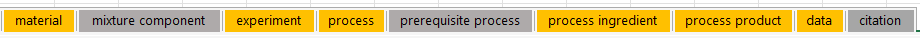

# Customizing the Excel Sheets

- Required sheets are colored
   Orange 

- Optional sheets are colored
   Grey 

 

> **Sheets CANNOT be renamed**, but **sheets CAN be removed**

 

## The general structure for all sheets

<blockquote>
    <table>
      <tr>
        <td class="row-1">
            <a href="/excel rows/#row-1-options-list">
              abstract category
            </a>
        </td>
      </tr>
      <tr>
        <td class="row-2">
            <a href="/individual sheets/#sheets">
              field name
            </a>
        </td>
      </tr>
      <tr class="row-3">
        <th class="row-3">
            <a href="https://github.com/hgrecco/pint/blob/master/pint/default_en.txt" target="_blank">
              units
            </a>
        </th>
      </tr>
      <tr class="row-4">
        <td>
          <em>Your values</em>
        </td>
      </tr>
    </table>
</blockquote>

 

---

## Sheets

#### <u>material</u> sheet

 

Define all materials that will be referenced throughout the document.

| Row 2                                                                         | Row 1      | Required | Expected Value     |
|-------------------------------------------------------------------------------|------------|----------|--------------------|
| \*name                                                                        | attribute  | yes      | unique string      |
| any [identifier key](https://criptapp.org/keys/material-identifier-key/)      | identifier | no       | refer to key table |
| any [material property key](https://criptapp.org/keys/material-property-key/) | property   | no       | refer to key table |
| notes                                                                         | attribute  | no       | string             |

 

> options for each row are clickable links in the chart below:

<table>
  <tr>
    <td class="row-1">
      <a class="row-1" href="/excel rows/#row-1-options-list" style="color: blue">
        <em><u>supported abstract categories</u></em>
      </a>
    </td>
  </tr>
  <tr>
    <td class="row-2">
    <a class="row-2" href="https://criptapp.org/keys/material-property-key/" target="_blank" style="color: blue">
      <em><u>supported column field names</u></em>
    </a>
    </td>
  </tr>
  <tr>
    <th class="row-3-in-table">
      <a href="https://github.com/hgrecco/pint/blob/master/pint/default_en.txt" target="_blank" style="color: blue">
        <em><u>supported units</u></em>
      </a>
    </th>
  </tr>
  <tr>
    <td class="row-4">
      <em>Your values recorded</em>
    </td>
  </tr>
</table>

 

---

 

#### <u>mixture component</u> sheet (optional)

This sheet Defines the components of mixture materials.

 

<blockquote>
  Before recording any mixtures, the components and materials must be first defined in 
  materials sheet.
</blockquote>

Row 1 is always <code>relation</code> and Row 2 is always
<code>*mixture</code> and <code>*material</code>

<blockquote>
  Row 1 is always <code>relation</code>, because each column of the
  mixture sheet <b>MUST</b> reference the material sheet
</blockquote>

 

| Row 2      | Row 1    | Required | Expected Value                                |
|------------|----------|----------|-----------------------------------------------|
| \*mixture  | relation | yes      | value from `*name` column of `material` sheet |
| \*material | relation | yes      | value from `*name` column of `material` sheet |

 

<table>
  <tr>
    <td class="row-1">
      <u class="row-1">relation</u> 
    </td>
    <td class="row-1">
      <u class="row-1">relation</u> 
    </td>
  </tr>
  <tr>
    <td class="row-2">
      *mixture
        (Required)
    </td>
    <td class="row-2">
      *material
        (Required)
    </td>
  </tr>
  <tr>
    <th class="row-3">
      

    </th>
    <th class="row-3">
      

    </th>
  </tr>
  <tr>
    <td class="row-4 user-input-row">
      value comes from *name of mixture sheet
    </td>
    <td class="row-4 user-input-row">
      value from *name of materials sheet
    </td>
  </tr>
</table>

---

 

#### <u> experiment</u> sheet

This sheet defines the experiment

| Row 2   | Row 1     | Required | Value Type                               |
|---------|-----------|----------|------------------------------------------|
| \*name  | attribute | yes      | unique value                             |
| funding | attribute | no       | list of values (e.g, `str1; str2; str3`) |
| notes   | attribute | no       | string                                   |

 

> If there are multiple sources for funding please list them and separate each one with a `";"`
> (e.g, `Grants; NSF; IRIS`)

 

<table>
  <tr>
    <td class="row-1">
      <u class="row-1">attribute</u> 
    </td>
    <td class="row-1">
      <u class="row-1">attribute</u> 
    </td>
    <td class="row-1">
      <u class="row-1">attribute</u> 
    </td>
  </tr>
  <tr>
    <td class="row-2">
      *name
        (Required)
    </td>
    <td class="row-2">
      notes 
        (optional)
    </td>
    <td class="row-2">
      funding 
        (optional)
    </td>
  </tr>
  <tr>
    <th class="row-3">
      

    </th>
    <th class="row-3">
      

    </th>
    <th class="row-3">
      

    </th>
  </tr>
  <tr>
    <td class="row-4 row-4-required-optional-label">
      unique experiment name
    </td>
    <td class="row-4 row-4-required-optional-label">
      These are my notes
    </td>
    <td class="row-4 row-4-required-optional-label">
      funder 1; funder 2; funder 3; funder 4;
    </td>

  </tr>
</table>

---

 

#### <u>process</u> sheet

Define the processes of each experiment.

| Row 2                                                                       | Row 1     | Required | Expected Value                                                                          |
|-----------------------------------------------------------------------------|-----------|----------|-----------------------------------------------------------------------------------------|
| \*experiment                                                                | relation  | yes      | string from `*name`column of`experiment` sheet                                          |
| \*name                                                                      | attribute | yes      | unique string                                                                           |
| \*type                                                                      | attribute | yes      | any [process type](https://criptapp.org/keys/process-type/)                             |
| keywords                                                                    | attribute | no       | list of [keywords](https://criptapp.org/keys/process-keyword/) (e.g,`str1; str2; str3`) |
| description                                                                 | attribute | no       | string                                                                                  |
| equipment                                                                   | attribute | no       | list of [equipment](https://criptapp.org/keys/equipment/) (e.g, `str1; str2; str3`)     |
| any [process property key](https://criptapp.org/keys/process-property-key/) | property  | no       | refer to key table                                                                      |
| any [condition key](https://criptapp.org/keys/condition-key/)               | condition | no       | refer to key table                                                                      |
| notes                                                                       | attribute | no       | string                                                                                  |

 

<table>
  <tr>
    <td class="row-1">
      <u class="row-1">relation</u> 
    </td>
    <td class="row-1">
      <u class="row-1">attribute</u> 
    </td>
    <td class="row-1">
      <u class="row-1">attribute</u> 
    </td>
    <td class="row-1">
      <u class="row-1">attribute</u> 
    </td>
    <td class="row-1">
      <u class="row-1">
        <a href="##row-1-options-list">property</a>
      </u> 
    </td>
    <td class="row-1">
      <u class="row-1">condition</u> 
    </td>
    <td class="row-1">
      <u class="row-1">condition</u> 
    </td>

  </tr>
  <tr>
    <td class="row-2">
      *experiment
        (Required)
    </td>
    <td class="row-2">
      *name 
        (Required)
    </td>
    <td class="row-2">
      *type 
        (Required)
    </td>
    <td class="row-2">
      keywords
        (optional)
    </td>
    <td class="row-2">
      <a href="https://criptapp.org/keys/process-property-key/" target="_blank">process property</a>
        (optional)
    </td>    
    <td class="row-2">
      <a href="https://criptapp.org/keys/condition-key/" target="_blank">any condition value</a>
        (optional)
    </td>
    <td class="row-2">
      <a href="https://criptapp.org/keys/condition-key/" target="_blank">any condition value</a>
        (optional)
    </td>

  </tr>
  <tr>
    <th class="row-3">
      

    </th>
    <th class="row-3">
      

    </th>
    <th class="row-3">
      

    </th>
    <th class="row-3">
      

    </th>
    <th class="row-3">
      

    </th>
    <th class="row-3-in-table">
      
units

    </th>
    <th class="row-3-in-table">
      
units

    </th>

  </tr>
  <tr>
    <td class="row-4 row-4-required-optional-label">
      value from *name column of experiment sheet
    </td>
    <td class="row-4 row-4-required-optional-label">
      pick a unique process name
    </td>
    <td class="row-4 row-4-required-optional-label">
      NSF; MIT; NASA; Dow; Pepsi
    </td>
    <td class="row-4 row-4-required-optional-label">
      my keywords to find my process
    </td>
    <td class="row-4 row-4-required-optional-label">
      description of my process
    </td>
    <td class="row-4 row-4-required-optional-label">
      100.0
    </td>
    <td class="row-4 row-4-required-optional-label">
      55.26
    </td>

  </tr>
</table>

   

Example:

<blockquote>
<table>
  <tr>
    <td class="row-1">
      <u class="row-1">relation</u> 
    </td>
    <td class="row-1">
      <u class="row-1">attribute</u> 
    </td>
    <td class="row-1">
      <u class="row-1">attribute</u> 
    </td>
    <td class="row-1">
      <u class="row-1">attribute</u> 
    </td>
    <td class="row-1">
      <u class="row-1">attribute</u> 
    </td>
    <td class="row-1">
      <u class="row-1">condition</u> 
    </td>
    <td class="row-1">
      <u class="row-1">condition</u> 
    </td>

  </tr>
  <tr>
    <td class="row-2">
      *experiment
        (Required)
    </td>
    <td class="row-2">
      *name 
        (Required)
    </td>
    <td class="row-2">
      *type 
        (Required)
    </td>
    <td class="row-2">
      keywords
        (optional)
    </td>
    <td class="row-2">
      description
        (optional)
    </td>    
    <td class="row-2">
      temperature
        (optional)
    </td>
    <td class="row-2">
      time_duration
        (optional)
    </td>

  </tr>
  <tr>
    <th class="row-3">
      

    </th>
    <th class="row-3">
      

    </th>
    <th class="row-3">
      

    </th>
    <th class="row-3">
      

    </th>
    <th class="row-3">
      

    </th>
    <th class="row-3-in-table">
      
degC

    </th>
    <th class="row-3-in-table">
      
min

    </th>

  </tr>
  <tr>
    <td class="row-4 row-4-required-optional-label">
      value from *name column of experiment sheet
    </td>
    <td class="row-4 row-4-required-optional-label">
      pick a unique process name
    </td>
    <td class="row-4 row-4-required-optional-label">
      NSF; MIT; NASA; Dow; Pepsi
    </td>
    <td class="row-4 row-4-required-optional-label">
      my keywords to find my process
    </td>
    <td class="row-4 row-4-required-optional-label">
      description of my process
    </td>
    <td class="row-4 row-4-required-optional-label">
      100.0
    </td>
    <td class="row-4 row-4-required-optional-label">
      55.26
    </td>

  </tr>
</table>

</blockquote>

---

 

#### process equipment sheet (optional)

Define the equipment used in a process.

| Row 2                                                         | Row 1     | Required | Expected Value                                                |
|---------------------------------------------------------------|-----------|----------|---------------------------------------------------------------|
| \*process                                                     | relation  | yes      | value from `*name` column of `process` sheet                  |
| \*equipment key                                               | attribute | yes      | any [equipment key](https://criptapp.org/keys/equipment-key/) |
| description                                                   | attribute | no       | string                                                        |
| any [condition key](https://criptapp.org/keys/condition-key/) | condition | no       | refer to key table                                            |
| \*citation                                                    | relation  | yes      | value from `*name` column of `citation` sheet                 |

 

<table>
  <tr>
    <td class="row-1">
      <u class="row-1">relation</u> 
    </td>
    <td class="row-1">
      <u class="row-1">attribute</u> 
    </td>
    <td class="row-1">
      <u class="row-1">attribute</u> 
    </td>
    <td class="row-1">
      <u class="row-1">condition</u> 
    </td>
    <td class="row-1">
      <u class="row-1">relation</u> 
    </td>
  </tr>
  <tr>
    <td class="row-2">
      *process
        (Required)
    </td>
    <td class="row-2">
        <a href="https://criptapp.org/keys/equipment-key/" target="_blank">*select equipment</a>
        (Required)
    </td>    
    <td class="row-2">
      description
        (optional)
    </td>
    <td class="row-2">
      <a href="https://criptapp.org/keys/condition-key/" target="_blank">condition</a>
        (optional)
    </td>
    <td class="row-2">
        citation
        (optional)
    </td>
  </tr>
  <tr>
    <th class="row-3">
      

    </th>
    <th class="row-3">
      

    </th>
    <th class="row-3">
      

    </th>
    <th class="row-3-in-table">
      <a style="color: blue" href="https://github.com/hgrecco/pint/blob/master/pint/default_en.txt" target="_blank">supported units</a>
    </th>
    <th class="row-3-in-table">
      

    </th>
  </tr>
  <tr>
    <td class="row-4 row-4-required-optional-label">
       value from <code>*name</code> column of process sheet
    </td>
    <td class="row-4 row-4-required-optional-label">
      equipment used in process
    </td>
    <td class="row-4 row-4-required-optional-label">
      description of the equipment
    </td>
    <td class="row-4 row-4-required-optional-label">
      value/description of condition
    </td>
    <td class="row-4 row-4-required-optional-label">
      value from <code>*name</code> column of citation sheet
    </td>
  </tr>
</table>

---

 

<h2>
 <u>prerequisite process</u> 
 sheet 
 (optional)
</h2>

Define the immediate prerequisites for each process.

> e.g., Assuming `A -> B -> C`, the immediate prerequisite of `C` is `B` (not `A`).

| Row 2          | Row 1    | Required | Value Type                                    |
|----------------|----------|----------|-----------------------------------------------|
| \*process      | relation | yes      | string from `*name` column of `process` sheet |
| \*prerequisite | relation | yes      | string from `*name` column of `process` sheet |

 

<table>
  <tr>
    <td class="row-1">
      <u class="row-1">relation</u> 
    </td>
    <td class="row-1">
      <u class="row-1">relation</u> 
    </td>
  </tr>
  <tr>
    <td class="row-2">
      *process
        (Required)
    </td>
    <td class="row-2">
      *prerequisite
        (Required)
    </td>
  </tr>
  <tr>
    <th class="row-3">
      

    </th>
    <th class="row-3">
      

    </th>
  </tr>
  <tr>
    <td class="row-4 row-4-required-optional-label">
      value from *name of process sheet
    </td>
    <td class="row-4 row-4-required-optional-label">
      value from *name of process sheet
        <em>immediate prerequisite step</em>
    </td>
  </tr>
</table>

---

 

#### <u>process ingredient</u> sheet

 

> Defines the ingredients used in the process

 

Define the ingredients for each process and their respective quantities.

| Row 2                                                       | Row 1     | Required | Value Type                                                              |
|-------------------------------------------------------------|-----------|----------|-------------------------------------------------------------------------|
| \*process                                                   | relation  | yes      | value from `*name` column of `process` sheet                            |
| \*material                                                  | relation  | yes      | value from `*name` column of `material` sheet                           |
| \*keyword                                                   | attribute | yes      | any [ingredient keyword](https://criptapp.org/keys/ingredient-keyword/) |
| any [quantity key](https://criptapp.org/keys/quantity-key/) | quantity  | yes      | refer to key table                                                      |

 

<table>
  <tr>
    <td class="row-1">
      <u class="row-1">relation</u> 
    </td>
    <td class="row-1">
      <u class="row-1">relation</u> 
    </td>
    <td class="row-1">
      <u class="row-1">attribute</u> 
    </td>
    <td class="row-1">
      <u class="row-1">quantity</u> 
    </td>
    <td class="row-1">
      <u class="row-1">quantity</u> 
    </td>
    <td class="row-1">
      <u class="row-1">quantity</u> 
    </td>
  </tr>
  <tr>
    <td class="row-2">
      *process
        (Required)
    </td>
    <td class="row-2">
      *material 
        (Required)
    </td>    
    <td class="row-2">
      *keyword
        (Required)
    </td>
    <td class="row-2">
      <a href="https://criptapp.org/keys/quantity-key/" 
      target="_blank">quantity value</a>
        (optional)
    </td>
    <td class="row-2">
      <a href="https://criptapp.org/keys/quantity-key/"
        target="_blank">quantity value</a>
        (optional)
    </td>
      <td class="row-2">
      <a href="https://criptapp.org/keys/quantity-key/"
        target="_blank">quantity value</a>
        (optional)
    </td>

  </tr>
  <tr>
    <th class="row-3">
      

    </th>
    <th class="row-3">
      

    </th>
    <th class="row-3">
      

    </th>
    <th class="row-3-in-table">
      
ml

    </th>
    <th class="row-3-in-table">
      
g

    </th>
    <th class="row-3-in-table">
      
mole

    </th>
  </tr>
  <tr>
    <td class="row-4 row-4-required-optional-label">
       value comes from *name column of the process sheet
    </td>
    <td class="row-4 row-4-required-optional-label">
      value comes from *name column of the materials sheet
    </td>
    <td class="row-4 row-4-required-optional-label">
      my keyword to find this ingredient
    </td>
    <td class="row-4 row-4-required-optional-label">
      5
    </td>
    <td class="row-4 row-4-required-optional-label">
      0.455
    </td>
    <td class="row-4 row-4-required-optional-label">
      10
    </td>
  </tr>
</table>

---

 

#### <u>process product</u> sheet

 

> This sheet describes the resulting product after completing a process

 

Define the material products of each process.

| Row 2      | Row 1    | Required | Value Type                                  |
|------------|----------|----------|---------------------------------------------|
| \*process  | relation | yes      | string from `*name`column of`process`sheet  |
| \*material | relation | yes      | string from`*name`column of`material` sheet |

 

<table>
  <tr>
    <td class="row-1">
      <u class="row-1">relation</u> 
    </td>
    <td class="row-1">
      <u class="row-1">relation</u> 
    </td>
  </tr>
  <tr>
    <td class="row-2">
      *process
        (Required)
    </td>
    <td class="row-2">
      *material 
        (Required)
    </td>
  </tr>
  <tr>
    <th class="row-3">
      

    </th>
    <th class="row-3">
      

    </th>
  </tr>
  <tr>
    <td class="row-4 row-4-required-optional-label">
       value comes from *name column of the process sheet
    </td>
    <td class="row-4 row-4-required-optional-label">
      value comes from *name column of the materials sheet
    </td>
  </tr>
</table>

---

 

#### <u>data</u> sheet

 

> This sheet defines the data files you want to upload to CRIPT, such as a csv file from a robot, an image, or any other
> type of file

 

Define the data sets you will be associating with properties, etc.

| Row 2        | Row 1     | Required | Value Type                                            |
|--------------|-----------|----------|-------------------------------------------------------|
| \*experiment | relation  | yes      | string from `*name`column of`experiment`sheet         |
| \*name       | attribute | yes      | unique string                                         |
| \*type       | attribute | yes      | any [data type](https://criptapp.org/keys/data-type/) |
| sample_prep  | attribute | no       | string                                                |
| citation     | relation  | no       | string from`*name`column of`citation` sheet           |
| notes        | attribute | no       | string                                                |

 

<table>
  <tr>
    <td class="row-1">
      <u class="row-1">relation</u> 
    </td>
    <td class="row-1">
      <u class="row-1">attribute</u> 
    </td>
    <td class="row-1">
      <u class="row-1">attribute</u> 
    </td>    
    <td class="row-1">
      <u class="row-1">attribute</u> 
    </td>
  </tr>
  <tr>
    <td class="row-2">
      *experiment
        (Required)
    </td>
    <td class="row-2">
      *name 
        (Required)
    </td>
    <td class="row-2">
      *type 
        (Required)
    </td>
    <td class="row-2">
      *source 
        (optional)
    </td>
  </tr>
  <tr>
    <th class="row-3">
      

    </th>
    <th class="row-3">
      

    </th>
    <th class="row-3">
      

    </th>
    <th class="row-3">
      

    </th>
  </tr>
  <tr>
    <td class="row-4" style="font-size: 0.8rem;">
       value from *name column of experiment sheet
    </td>
    <td class="row-4" style="font-size: 0.8rem;">
      Pick a unique name
    </td>
    <td class="row-4" style="font-size: 0.8rem;">
      My type
    </td>
    <td class="row-4" style="font-size: 0.8rem;">
        <b>Can be either local:</b>
         
        <em>
            C:\Users\myUsername\Desktop\MIT\cript-excel-uploader\example_template_v0-3-1.xlsx
        </em>
           
        <b>Or on the web: </b>
         
        <em>
            https://google.com
        </em>
    </td>
  </tr>
</table>

 

---

 

#### <u>citation</u> sheet

> This sheet can be used to reference any sources used in the experiments that you want to cite in CRIPT

<blockquote>
  <code>Row 1:</code> can only be an <em><q>attribute</q></em>  
  <code>Row 2:</code> MUST have a title column, but ALL other columns are optional  
  <code>Row 3:</code> This row is left blank
</blockquote>

 

Define references to be associated with properties, etc. as citations.

| Row 2     | Row 1     | Required | Value Type    |
|-----------|-----------|----------|---------------|
| \*title   | attribute | yes      | unique string |
| doi       | attribute | no       | string        |
| authors   | attribute | no       | string        |
| journal   | attribute | no       | string        |
| publisher | attribute | no       | string        |
| year      | attribute | no       | attribute     |
| volume    | attribute | no       | string        |
| issue     | attribute | no       | string        |
| pages     | attribute | no       | string        |
| issn      | attribute | no       | string        |
| arxiv_id  | attribute | no       | string        |
| pmid      | attribute | no       | string        |
| website   | attribute | no       | string        |
| notes     | attribute | no       | string        |

 

<table style="display: block; max-width: fit-content; margin: 0 auto; overflow-x: auto; white-space: nowrap;">
  <tr>
    <td class="row-1">
      <u class="row-1">attribute</u> 
    </td>
    <td class="row-1">
      <u class="row-1">attribute</u> 
    </td>
    <td class="row-1">
      <u class="row-1">attribute</u> 
    </td>
    <td class="row-1">
      <u class="row-1">attribute</u> 
    </td>
    <td class="row-1">
      <u class="row-1">attribute</u> 
    </td>
    <td class="row-1">
      <u class="row-1">attribute</u> 
    </td>
    <td class="row-1">
      <u class="row-1">attribute</u> 
    </td>
    <td class="row-1">
      <u class="row-1">attribute</u> 
    </td>
    <td class="row-1">
      <u class="row-1">attribute</u> 
    </td>
    <td class="row-1">
      <u class="row-1">attribute</u> 
    </td>
    <td class="row-1">
      <u class="row-1">attribute</u> 
    </td>
    <td class="row-1">
      <u class="row-1">attribute</u> 
    </td>
    <td class="row-1">
      <u class="row-1">attribute</u> 
    </td>
    <td class="row-1">
      <u class="row-1">attribute</u> 
    </td>
  </tr>
  <tr>
    <td class="row-2">
      *title
        (*Required)
    </td>
    <td class="row-2">
      doi 
        (optional)
    </td>
    <td class="row-2">
      authors
        (optional)
    </td>
    <td class="row-2">
      journal
        (optional)
    </td>
    <td class="row-2">
      publisher
        (optional)
    </td>
    <td class="row-2">
      year
        (optional)
    </td>
    <td class="row-2">
      volume
        (optional)
    </td>
    <td class="row-2">
      issue
        (optional)
    </td>
    <td class="row-2">
      pages
        (optional)
    </td>
    <td class="row-2">
      issn
        (optional)
    </td>
    <td class="row-2">
      arxiv_id
        (optional)
    </td>
    <td class="row-2">
      pmid
        (optional)
    </td>
    <td class="row-2">
      website
        (optional)
    </td>
    <td class="row-2">
      notes
        (optional)
    </td>
  </tr>
  <tr>
    <th class="row-3">
      

    </th>
    <th class="row-3">
      

    </th>
    <th class="row-3">
      

    </th>
    <th class="row-3">
      

    </th>
    <th class="row-3">
      

    </th>
    <th class="row-3">
      

    </th>
    <th class="row-3">
      

    </th>
    <th class="row-3">
      

    </th>
    <th class="row-3">
      

    </th>
    <th class="row-3">
      

    </th>
    <th class="row-3">
      

    </th>
    <th class="row-3">
      

    </th>
    <th class="row-3">
      

    </th>
    <th class="row-3">
      

    </th>
  </tr>
  <tr>
    <td class="row-4" style="font-size: 0.8rem;">
      Each title must be unique
    </td>
    <td class="row-4" style="font-size: 0.8rem;">
      your doi here
    </td>
    <td class="row-4" style="font-size: 0.8rem;">
      Author Here
    </td>
    <td class="row-4" style="font-size: 0.8rem;">
      Journal name
    </td>
    <td class="row-4" style="font-size: 0.8rem;">
      publisher name
    </td>
    <td class="row-4" style="font-size: 0.8rem;">
      year published
    </td>
    <td class="row-4" style="font-size: 0.8rem;">
      volume number
    </td>
    <td class="row-4" style="font-size: 0.8rem;">
      issue
    </td>
    <td class="row-4" style="font-size: 0.8rem;">
      pages
    </td>
    <td class="row-4" style="font-size: 0.8rem;">
      issn
    </td>
    <td class="row-4" style="font-size: 0.8rem;">
      arxiv_id
    </td>
    <td class="row-4" style="font-size: 0.8rem;">
      pmid
    </td>
    <td class="row-4" style="font-size: 0.8rem;">
      https://www.example.com
    </td>
    <td class="row-4" style="font-size: 0.8rem;">
      These are my notes
    </td>

  </tr>
</table>

   

---
