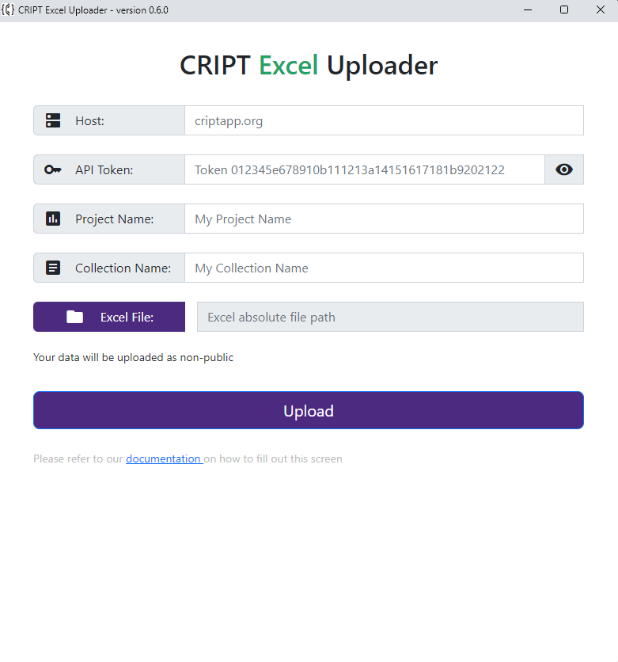

# Alternative Way to Launch the Executable

In addition to launching the graphical user interface by downloading the correct file, and running it via double click,
users can always launch the program via terminal.

You may want to run the program via terminal for several reasons.

Follow these steps to launch the program via terminal:

1. Git clone the
   <a href="https://github.com/C-Accel-CRIPT/cript-excel-uploader" target="_blank">
   master branch of the CRIPT Excel Uploader repository
   </a>
```bash
git clone https://github.com/C-Accel-CRIPT/cript-excel-uploader.git
```

2. Navigate to the repository that was just cloned
```bash
cd cript-excel-uploader
```

3. Create virtual environment for needed dependencies
    * **_Windows:_** `python -m venv .\venv`
    * **_Mac & Linux:_** `python3 -m venv ./venv`

4. Activate virtual environment
    * **_Windows:_** `.\venv\Scripts\activate`
    * **_Mac & Linux:_** `source venv/bin/activate`

6. Install needed dependencies
```bash
pip install -r requirements_dev.txt
```

7. Navigate to correct directory
    * **_Windows:_** `cd .\src\`
    * **_Mac & Linux:_** `cd src/`

8. Run the GUI
    * **_Windows:_** `python gui_main.py`
    * **_Mac & Linux:_** `python3 gui_main.py`

The CRIPT Excel Uploader graphical user interface should now be running

